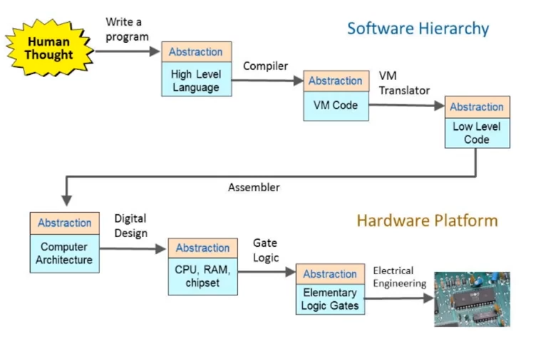
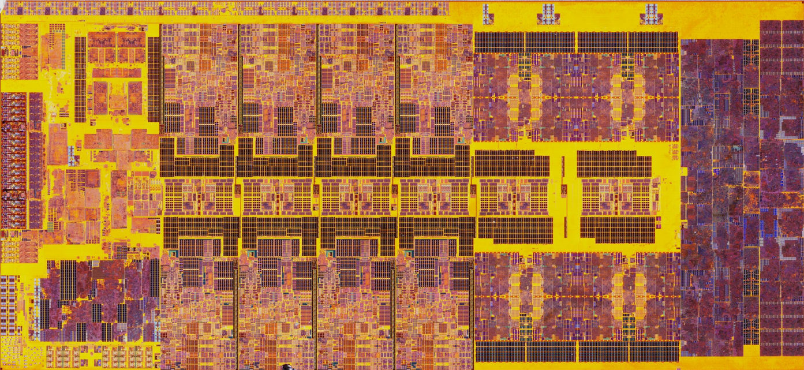
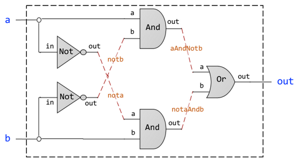

This post summarizes my notes as I go through the popular nand2tetris course. These notes are loosely based on the original material and contain biased emphasis on areas I deem important.

You can also find my implementation of the course projects here.

## 1. Abstraction is the Name of the Game
The beauty and effectiveness of computer science at treating real-world problems stems from its ability to indefinitely abstract away detail. Abstraction is a powerful process that allows us to expose functionality (the "what") to users without requiring their complete understanding of what has been done (the "how"). This can be referred to as abstraction, decoupling or separation of concerns and can be achieved through the design of interfaces in their broadest definition.

Abstraction in computer science happens at every level of the stack, it starts as high as surfing the net in a web browser and ends as low as the chemical properties of Silicon and characteristics of electrons. Your role determines what and how many layers of abstraction you need to cut through to be effective. 

In some cases, you might also possess the power to cut through abstraction, but deliberately choose to stay high as it is often more efficient to do so.

Point stands that regardless of where you choose to stay, it is recommended - and sometimes imperative - to possess that power; not only will the knowledge of the concrete make you better at working with the abstract, but it also allows you to escape the parochial, pitiful state of being a consumer of other people's abstractions; it allows you to make your own, to mold the concrete and even create your own abstract for others to consume.

Simplified (abstracted) diagram of the abstraction within a computer system:


Granted, this course does not cover the electrical engineering component but instead decides to "abstract" it away as cutting through that layer of abstraction is a bit too far for us as computer scientists (although foundational knowledge of electrical engineering can definitely be useful).

Instead of electrical engineering, we will start off using Hardware Definition Language (HDL) to define our elementary logic gates before we can go further.

Let's see what that is about.

## 2. Wisps of Logic
I will assume you know about Boolean functions, if not, you can read about them [here](https://en.wikipedia.org/wiki/Boolean_function)

These primitives all boil down to the NAND gate, the primitive of all primitives. By combining NAND gates we can build every single logic function there is.

Using these primitives, combined with a set of principles that govern them referred to as Boolean algebra, we can manipulate logic; we can play with logic just as we play with numbers, and we can ultimately mold logic to weave more complex, preferably useful functions.

Here are some of principles (laws) we can use with our Boolean logic:
$$
\begin{gather}
\text{Identities}\\
x \land 0 = 0\\
x \lor 1 = 1\\\\

\text{Idempotency Law}\\
x \land x = x\\
x \lor x = x\\\\

\text{Double Negation Law}\\
\lnot (\lnot x) = x\\\\

\text{Commutative Laws}\\
(x \land y) = (y \land x)\\
(x \lor y) = (y \lor x)\\\\
\text{Associative Laws}\\
(x \land (y \land z)) = ((x \land y) \land z)\\
(x \lor (y \lor z)) = ((x \lor y) \lor z)\\\\

\text{Distributive Laws}\\
(x \land (y \lor z)) = (x \land y) \lor (x \land z)\\
(x \lor (y \land z)) (x \lor y) \land (x \lor z)\\\\

\text{DeMorgan's Law}\\
\lnot(x \land y) = \lnot(x) \lor \lnot(y)\\
\lnot(x \lor y) \lnot(x) \land \lnot(y)\\
\end{gather}
$$
With our primitives (Boolean functions) and principles (Boolean algebra) in hand, we have achieved a fascinating feat, one that forms the basis of all computer systems.

However, these are all concepts, they are ideas in the heads of logicians and mathematicians. How can we turn them into... well, computers?

This remained an obstacle for decades, an example of how theoretical mathematics can run circles around engineering application, either because of lack of need or lack of means.

Fortunately, thanks to advances in other domains such as chemistry, physics and electrical engineering, we could finally able to assemble physical devices that perform the equivalent logical function of these conceptual primitives, devices such as relays and switches, vacuum tubes and transistors, allowed us to mimic the function of logical NOT, AND and OR.

Hundreds and thousands of these physical components could be combined to perform basic, yet unprecedented functions - such as arithmetic - that were never within the domain of a machine throughout history, at least not with the speed and autonomy of computers. It was truly revolutionary.


Intel 8008 microprocessor released in 1972. Credits: [electronicsinfoline](http://www.electronicsinfoline.com/pin/45108/)

Further scientific breakthroughs and technological advancements particularly within material science and fabrication processes helped us fit more of these devices on smaller scales allowing for larger scales of integration and more complex functions to be constructed within a very small space.


Intel Core i9-13900K Raptor Lake ES released in 2022. Credits: [wccftetch.com](https://wccftech.com/intel-raptor-lake-core-i9-13900k-gets-high-res-beautiful-cpu-die-shot/).

Isn't it beautiful?

It is, however, that beauty calls for a question. How is that even possible? How can we construct such sophisticated devices from the trivial primitives called logic gates?

The answer to this question will be clearer as we go about building our own instruction set and CPU within this course. Needless to say, our hardware will be trivial, it will definitely not come anywhere close the 2022 chip pictured above; actually not even anywhere close to the 52-year-old Intel 8008. It is the complex. You can get an idea of what modern chip design requires by reading about [VLSI](https://en.wikipedia.org/wiki/Very-large-scale_integration), [fabrication](https://en.wikipedia.org/wiki/Semiconductor_device_fabrication) and checking out [this amazing video about how microchips are made](https://www.youtube.com/watch?v=dX9CGRZwD-w)
That aside, let's get started by discussing logic functions; these are often a black boxes that take some input and return some output. Can we determine the inner workings of a function based primarily on its inputs and outputs?

That is, is it possible to deconstruct a function into it is constituent logic gates?, 

Let's take XOR as an example, we can start with a truth table showcasing all the possible inputs and outputs for the function:

| $a$ | $b$ | $a \oplus b$ |
| --- | --- | ------------ |
| 0   | 0   | 0            |
| 0   | 1   | 1            |
| 1   | 0   | 1            |
| 1   | 1   | 0            |

Apparatus such as truth tables and [K-maps](https://en.wikipedia.org/wiki/Karnaugh_map) are means that help represent composite Boolean functions and simplify them into their essential forms.

then move on to draw the conceptual internals of the gate. It might look similar to the following:


Notice that everything outside the dashed box is our *Abstraction*, it is the interface that a user of this chip would need to deal with, granted, it is very simple.

Everything within however, is part of the *Implementation* of the chip, it is often more demanding and requires more design. 

## 3. HDL
We will be doing both within this course using [Hardware Definition Language (HDL)](https://en.wikipedia.org/wiki/Hardware_description_language) which is a declarative language. By declarative, that means there is no actions or procedures performed by HDL itself, instead it is simply a static description of the anticipated behavior of some non-existing circuit.

This is where an interpreter or agent, external to our HDL comes into play; such interpreters parse our HDL declarations before simulating or even synthesizing them. They could also perform other intermediary tasks such as logic simplification and power analysis for example.

**Common HDLs include:**
- VHDL
- Verilog

We will be using a minimal, custom HDL that is loosely similar to the two above. Our HDL will be interpreted by a custom hardware simulator provided within the course material.

```verilog
input a, b;
output c;

and g1(a, b, c);
```